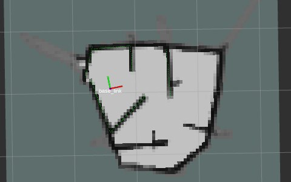

# Autonomous Exploration – TurtleBot

This package implements a frontier‑based exploration controller for a TurtleBot using ROS 2.  
Configuration is stored in [autonomous_exploration/config/params.yaml](autonomous_exploration/config/params.yaml).

---

## 1. Parameters

Current defaults in [autonomous_exploration/config/params.yaml](autonomous_exploration/config/params.yaml):

```yaml
lookahead_distance : 0.24 # lookahead distance
speed             : 0.18  # maximum speed
expansion_size    : 3     # wall expansion coefficient
target_error      : 0.15  # target error margin
robot_r           : 0.2   # robot distance for local safety
```

| Parameter          | Meaning (layman)                                                                                         | Typical tuning                                                                                                      |
|--------------------|----------------------------------------------------------------------------------------------------------|---------------------------------------------------------------------------------------------------------------------|
| `lookahead_distance` | How far along the path the robot “aims” when steering.                                                  | Smaller → cautious, sharp turns. Larger → smoother, may cut corners / get closer to walls.                         |
| `speed`            | Max forward speed (m/s).                                                                                | Start low (0.10–0.18). Increase as confidence grows.                                                                |
| `expansion_size`   | How much obstacles are “fattened” in the costmap (in grid cells).                                       | Larger → keeps away from walls, can block narrow gaps. Smaller → fits tight gaps, higher collision risk.           |
| `target_error`     | Distance threshold (m) to consider a target/frontier reached.                                           | Too small → oscillates at goals. Too large → may stop short and map less.                                          |
| `robot_r`          | Safety radius used in local obstacle checks around the robot (m).                                       | Increase if it feels too close to obstacles; decrease if it is too conservative in narrow passages.                |

To change behaviour, edit the YAML file, rebuild, and re‑run.

---

## 2. Build & Run

From the workspace root:

```bash
cd /home/jw/Desktop/CDE2310/CDE2310_G10_2526
colcon build
source install/setup.bash
```

Then run the exploration node:

```bash
ros2 run autonomous_exploration control
```

Prerequisites (already running on robot / network):

- TurtleBot bringup (publishing `/scan`, `/odom`, `/tf`).
- SLAM node (publishing `/map`, e.g. slam_toolbox).

---

## 3. Typical Test Procedure (Physical Maze)

1. Start robot bringup (example, adapt to your model):

   ```bash
   ros2 launch turtlebot3_bringup robot.launch.py
   ```

2. Start SLAM:

   ```bash
   ros2 launch slam_toolbox online_async_launch.py
   ```

3. Check topics:

   ```bash
   ros2 topic list
   ```

   Expect at least: `/scan`, `/odom`, `/map`, `/cmd_vel`.

4. Start RViz2 and visualize:

   ```bash
   rviz2
   ```

   - Fixed frame: `map`
   - Displays: `/map`, `/scan`, `RobotModel`/TF.

5. Run exploration:

   ```bash
   ros2 run autonomous_exploration control
   ```

Have an emergency stop (Ctrl+C + physical stop button).

---

## 4. Per‑Session Testing & Validation 

- **Goal / success criteria: 100% Map Completion & 0 Collisions**  

**100% Map Completion Example**


## Session Info

- **Session ID / Name:** `S1`
- **Date & Time:** `27/03 3:32PM`
- **Maze / Environment:** 
- **Robot & ROS 2 distro:** `Humble`

### Setup

- **params.yaml (key values):**
  - `lookahead_distance:` `0.24` m
  - `speed:` `0.18` m/s
  - `expansion_size:` `3`
  - `target_error:` `0.15` m
  - `robot_r:` `0.2` m

### Procedure

Short bullet list of what was done (commands + steps):

- `Baseline testing of algorithm with params unchanged`

### Results

- **Outcome:** success / partial / **fail**
- **Run time:** `0` min `0` s
- **Mapped area (rough %):** `0 %`
- **Collisions / near‑collisions:** `________ / ________`

### Observations

Write 3–5 short points:

- `Slam Toolbox had QOS dependency issues, could run in gazebo but not with rosbu`
- `Bot did not move as no SLAM map was created`

### Changes for Next Session

- Parameter tweaks (before → after):
  - `speed:` `________ → ________`
  - `expansion_size:` `________ → ________`
  - other: `__________________________________________`
- Code or setup changes:
  - `in /opt/ros/humble/share/slam_toolbox/config directory, update the parameters in the mapper_params_online_async.yaml file to improve SLAM efficiency`

### Quick Summary

- What worked well: `________________________________________________`
- Main problem left: `Slam Map not created`


## Session Info

- **Session ID / Name:** `S2`
- **Date & Time:** `27/03 4:04PM`
- **Maze / Environment:** 
- **Robot & ROS 2 distro:** `Humble`

### Setup

- **params.yaml (key values):**
  - `lookahead_distance:` `0.24` m
  - `speed:` `0.18` m/s
  - `expansion_size:` `3`
  - `target_error:` `0.15` m
  - `robot_r:` `0.2` m

### Procedure

Short bullet list of what was done (commands + steps):

- `Below parameters changed in the mapper_params_online_async.yaml file:

slam_toolbox:
    ros__parameters:
    
    solver_plugin: solver_plugins::CeresSolver
    ceres_linear_solver: SPARSE_NORMAL_CHOLESKY
    ceres_preconditioner: SCHUR_JACOBI
    ceres_trust_strategy: LEVENBERG_MARQUARDT
    ceres_dogleg_type: TRADITIONAL_DOGLEG
    ceres_loss_function: None

    odom_frame: odom
    map_frame: map
    base_frame: base_footprint
    scan_topic: /scan
    use_map_saver: true
    mode: mapping

    debug_logging: false
    throttle_scans: 1
    transform_publish_period: 0.02
    map_update_interval: 1.0        # was 5.0 - faster map updates
    resolution: 0.05
    min_laser_range: 0.12           # was 0.0 - match LiDAR's (LDS-02) actual min range
    max_laser_range: 3.5            # was 20.0 - match LiDAR's (LDS-02) actual max range
    minimum_time_interval: 0.2      # was 0.5 - process scans more frequently
    transform_timeout: 0.2
    tf_buffer_duration: 30.
    stack_size_to_use: 40000000
    enable_interactive_mode: true

    use_scan_matching: true
    use_scan_barycenter: true
    minimum_travel_distance: 0.2    # was 0.5 - update after smaller movements
    minimum_travel_heading: 0.2     # was 0.5 - update after smaller rotations
    scan_buffer_size: 10
    scan_buffer_maximum_scan_distance: 3.5  # match max_laser_range
    link_match_minimum_response_fine: 0.1  
    link_scan_maximum_distance: 1.5
    loop_search_maximum_distance: 3.0
    do_loop_closing: true 
    loop_match_minimum_chain_size: 10           
    loop_match_maximum_variance_coarse: 3.0  
    loop_match_minimum_response_coarse: 0.35    
    loop_match_minimum_response_fine: 0.45

    correlation_search_space_dimension: 0.5
    correlation_search_space_resolution: 0.01
    correlation_search_space_smear_deviation: 0.1 

    loop_search_space_dimension: 8.0
    loop_search_space_resolution: 0.05
    loop_search_space_smear_deviation: 0.03

    distance_variance_penalty: 0.5      
    angle_variance_penalty: 1.0    
    fine_search_angle_offset: 0.00349     
    coarse_search_angle_offset: 0.349   
    coarse_angle_resolution: 0.0349        
    minimum_angle_penalty: 0.9
    minimum_distance_penalty: 0.5
    use_response_expansion: true
    min_pass_through: 2
    occupancy_threshold: 0.1`

### Results

- **Outcome:** success / **partial** / fail
- **Run time:** `0` min `15` s
- **Mapped area (rough %):** `5 %`
- **Collisions / near‑collisions:** `1 / ________`

### Observations

Write 3–5 short points:

- `Bot collided with wall after first turn`

### Changes for Next Session

- Parameter tweaks (before → after):
  - `speed:` `________ → ________`
  - `expansion_size:` `________ → ________`
  - other: `__________________________________________`
- Code or setup changes:
  - `Decrease speed to counteract SLAM latency issues, as well as smoother maneuvering`

### Quick Summary

- What worked well: `Map is generated and robot moves`
- Main problem left: `Robot does not avoid walls/obstacles effectively + SLAM map is generated slowly`


## Session Info

- **Session ID / Name:** `S3`
- **Date & Time:** `31/03 3:27PM`
- **Maze / Environment:** 
- **Robot & ROS 2 distro:** `Humble`

### Setup

- **params.yaml (key values):**
  - `lookahead_distance:` `0.24` m
  - `speed:` `0.09` m/s
  - `expansion_size:` `3`
  - `target_error:` `0.15` m
  - `robot_r:` `0.2` m

### Procedure

Short bullet list of what was done (commands + steps):

- `max speed reduced from 0.18 m/s to 0.09 m/s`


### Results

- **Outcome:** success / partial / fail
- **Run time:** `` min `` s
- **Mapped area (rough %):** ` %`
- **Collisions / near‑collisions:** ` / ________`

### Observations

Write 3–5 short points:

- `

### Changes for Next Session

- Parameter tweaks (before → after):
  - `speed:` `________ → ________`
  - `expansion_size:` `________ → ________`
  - other: `__________________________________________`
- Code or setup changes:
  - `

### Quick Summary

- What worked well: ``
- Main problem left: ``