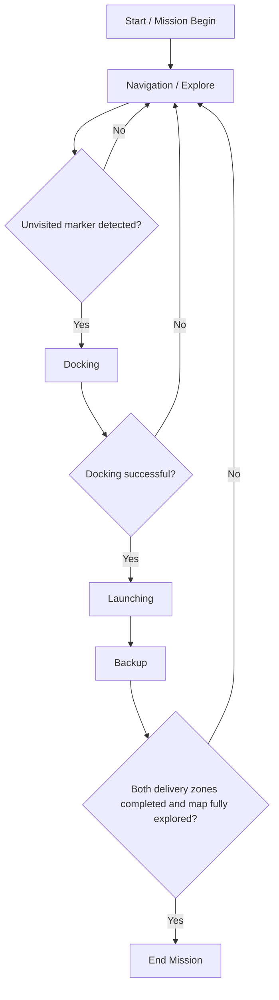

## 🔗 Navigation

- [Home](index.md)
- [Requirements Specification](requirements-specification.md)
- [Concept of Operations](con-ops.md)
- [High Level Design](high-level-design.md)
- [Software Subsystem: Navigation and FSM](subsystem-nav-fsm.md)
- [Software Subsystem: ArUco Marker Detection](subsystem-software-aruco.md)
- [Mechanical Subsystem](subsystem-mechanical.md)
- [Electrical Subsystem](subsystem-electrical.md)
- [Interface Control Document](interface-control-document.md)
- [Software and Firmware Development](software-firmware-development.md)
- [Testing Documentation](testing-documentation.md)
- [User Manual](user-manual.md)
- [Areas for Improvement](improvements.md)
- [Appendix](appendix.md)

---

# Concept of Operations

## Mission Context

The robot is an autonomous mobile robot (AMR) built on a TurtleBot3 Burger platform, designed to operate in a randomised, unknown warehouse-style arena. Its mission is to autonomously explore the environment, detect ArUco fiducial markers positioned near two delivery receptacles (one static, one dynamic), dock precisely in front of each receptacle, and deliver three ping-pong balls per receptacle using a rack-and-pinion launcher mechanism. The entire mission must be completed within a **25-minute execution window**.

There are two delivery zones:

- **Static receptacle** — a fixed delivery target identified by ArUco marker ID `0`.
- **Dynamic receptacle** — a moving delivery target identified by ArUco marker ID `1`, where an ultrasonic sensor is used to detect when the moving receptacle passes into range before triggering delivery.

The mission ends when both delivery zones have been serviced, or when the mission timer expires.

---

## System Overview

The robot integrates the following subsystems:

| Subsystem | Role |
|---|---|
| Navigation & SLAM | Frontier-based exploration using a 2D LiDAR occupancy grid |
| Finite State Machine (FSM) | Top-level mission orchestration and state arbitration |
| ArUco Marker Detection | Camera-based detection and 6-DOF pose estimation of delivery zone markers |
| Docking Controller | Precision alignment and approach to the detected marker |
| Shooter / Launcher | Sequential delivery of ping-pong balls into the receptacle |

All subsystems communicate over ROS 2 topics. The FSM acts as the central arbiter, consuming status signals from all subsystems and issuing state transitions accordingly.

---

## Normal Operating Scenario

1. The operator places the robot at the designated start position in the arena, loads 9 ping-pong balls into the tube, and ensures all hardware is powered and functioning.
2. The operator builds and sources the ROS 2 workspace, then launches the top-level bringup file for real hardware.
3. The robot boots into the `EXPLORE` state. Navigation begins autonomously — no further operator input is required during the mission.
4. As the robot explores, the camera continuously processes frames for ArUco markers. When a new, unvisited marker is detected, the FSM transitions to `DOCK`.
5. The docking controller aligns the robot perpendicularly in front of the marker and drives forward until the final proximity threshold is met.
6. On successful docking, the FSM transitions to `LAUNCH`. The shooter controller delivers three ping-pong balls into the receptacle.
   - For the **static receptacle**: three shots are fired with fixed inter-shot delays.
   - For the **dynamic receptacle**: the ultrasonic sensor polls for the moving receptacle to enter range before each shot, synchronising delivery with receptacle position.
7. After the shooting sequence completes, the FSM transitions to `BACKUP` (the robot reverses for ~2 seconds to clear the delivery zone), then returns to `EXPLORE`.
8. Steps 4–7 repeat for the second delivery zone.
9. Once both markers have been visited and the map is fully explored, the FSM transitions to `END` and the robot halts.

---


## System Workflow Flowchart



## Exploration Phase

- The navigation controller (`exploration_controller`) implements a **frontier-based exploration** strategy. The occupancy grid from SLAM is analysed to identify frontier cells — known free cells adjacent to unknown space.
- Frontiers are grouped and scored by a ratio of frontier size to path distance. The best frontier group is selected as the next navigation target.
- A B-spline is fitted to the A\* path for smooth traversal. A pure-pursuit controller tracks the path.
- Local obstacle avoidance (using LiDAR scan sectors) is layered on top of path following, with tunable avoidance distances.
- Exploration concludes when no new frontier groups remain, at which point `/map_explored` is published `True`.

---

## Marker Detection Phase

- The `aruco_pose_streamer` node subscribes to `/camera/image_raw` and processes every frame using OpenCV's ArUco detector with the `DICT_4X4_250` dictionary.
- Camera intrinsics are loaded from `/camera/camera_info`. A fallback pinhole model is used if intrinsics are invalid.
- When a marker is detected, its 6-DOF pose (translation vector `tvec` and rotation vector `rvec`) is estimated using `cv2.aruco.estimatePoseSingleMarkers`.
- The pose is broadcast as a TF transform (`aruco_marker_<id>`) and a `/marker_detected` signal (`Bool`) is published to the FSM.
- The FSM reads the marker's child frame ID suffix to determine the zone: `aruco_marker_0` → `static`, `aruco_marker_1` → `dynamic`.
- Each zone is tracked in `visited_markers`. Once a zone is marked as visited, further detections of that zone are ignored.

---

## Docking Phase

The docking controller (`docking_controller`) operates as an independent state machine with the following states:

| State | Behaviour |
|---|---|
| `IDLE` | Waits for FSM to signal `DOCK` and for a valid marker transform to be available. |
| `SEARCH` | Rotates in place until the marker is centred horizontally (`tx ≈ 0`). |
| `APPROACH_1` | Drives straight toward the marker until `tz < 0.30 m`. |
| `TURN_SIDE` | Rotates by `(π/2 − θ)` to begin the perpendicular approach manoeuvre. |
| `DRIVE_SIDE` | Drives laterally to reach the perpendicular line in front of the marker. |
| `TURN_FACE_MARKER` | Rotates to re-face the marker directly (`tx ≈ 0`). |
| `FINAL_APPROACH` | Drives straight toward the marker until `tz < 0.10 m` or front LiDAR reads `< 0.20 m`. |
| `DONE` | Stops motion, publishes `/dock_done = True`, returns to `IDLE`. |
| `ABORT` | Stops motion, publishes `/dock_done = False`, returns to `IDLE`. |
| `OBSTACLE_AVOIDANCE` | Temporarily overrides docking motion to clear a proximate obstacle. |
| `SPECIAL_SEARCH` | After obstacle avoidance, performs a 360° rotation scan to re-acquire the marker. |

**Watchdog conditions** (both trigger `ABORT`):

- Marker continuously invisible for **30 seconds** during any active docking state.
- Any single docking state active for more than **45 seconds**.

---

## Launcher / Shooter Phase

The `shooter_controller` node receives a `/shoot_type` command (`static` or `dynamic`) from the FSM on entering the `LAUNCH` state.

**Static delivery sequence:**

1. Shot 1 fires immediately.
2. A short delay (~0.1 s) separates shot 1 and shot 2.
3. A longer delay (~7.1 s) separates shot 2 and shot 3.

**Dynamic delivery sequence:** The ultrasonic sensor polls the distance to the moving receptacle at regular intervals. Each of the three shots follows a two-pass sequence:

- **Load pass**: the rack engages and the gate opens/closes to seat a ball.
- **Launch pass**: triggered only when the ultrasonic sensor reads `distance ≤ 0.70 m`, indicating the moving receptacle is within delivery range.

Each shot cycle uses a rack servo (continuous rotation) to pull back the launcher, a gate servo to release the ball, and timing parameters configured via ROS 2 parameters at launch time. Hardware actuation is gated by the `enable_hardware` parameter — when `False`, the node runs in simulation mode.

A minimum hold duration of **15 seconds** is enforced in the `LAUNCH` state before the FSM accepts a completion signal, ensuring all shots have time to execute.

---

## Post-Delivery Backup Phase

After the shooter signals completion, the FSM transitions to `BACKUP`. The robot reverses at `0.1 m/s` for **2 seconds** before returning to `EXPLORE`. This prevents the robot from immediately attempting to re-dock with the just-visited marker.

---

## Shutdown Sequence

1. Allow the mission to reach the `END` state naturally, or press `Ctrl+C` to interrupt all nodes.
2. Confirm the robot has stopped moving (`/cmd_vel` publishes zero-velocity).
3. Power down the TurtleBot3 motors and Raspberry Pi safely.
4. Remove any remaining ping-pong balls from the magazine before storing the robot.
5. Kill any stale ROS 2 daemon processes before the next run:
   ```bash
   ros2 daemon stop
   pkill -f ros2
   ```

---

## Fault / Recovery Scenarios

| Fault | Symptom | Response |
|---|---|---|
| Marker lost during docking | `docking_controller` logs "Marker lost" | Docking aborts (`/dock_done = False`); FSM returns to `EXPLORE` |
| Marker invisible > 30 s | Watchdog triggers in docking controller | State transitions to `ABORT` → `IDLE` |
| Docking state stalls > 45 s | Per-state watchdog fires | State transitions to `ABORT` → `IDLE` |
| Obstacle during docking | Front LiDAR reads within `robot_r` | `OBSTACLE_AVOIDANCE` activates; `SPECIAL_SEARCH` follows to re-acquire marker |
| Shooter hardware failure | `shooter_controller` logs error, publishes `/shoot_done = False` | FSM returns to `EXPLORE`; zone is not marked visited |
| No frontier groups found | Navigation publishes `/map_explored = True` | FSM checks marker count; transitions to `END` if both zones visited, else continues waiting |
| Ultrasonic sensor no-read | `_read_ultrasonic_distance_m` returns `None` | Dynamic delivery continues polling; no shot fires until a valid distance is read |
| Invalid camera intrinsics | `aruco_pose_streamer` logs fallback warning | Fallback pinhole model used; detection continues with reduced accuracy |
| SLAM map not ready | `exploration_controller` waits in loop | Navigation holds until `/map`, `/odom`, and `/scan` are all available |

---

## Operator Responsibilities

- Inspect and confirm all 9 ping-pong balls are correctly loaded into the magazine before launch.
- Confirm the `enable_hardware` parameter is set correctly (`True` for physical robot, `False` for simulation).
- Supply the correct launch file for the target environment (real hardware vs. Gazebo).
- Monitor `/rosout` and node logs for warnings during the early exploration phase.
- Do not intervene or manually move the robot once the mission has started; any physical interference may corrupt the SLAM map.
- Ensure the arena is set up as specified before starting the mission timer.
