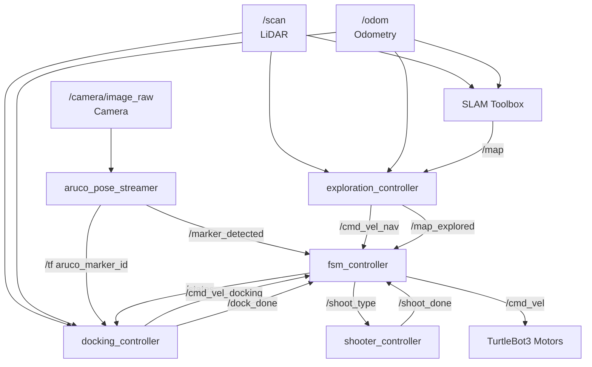
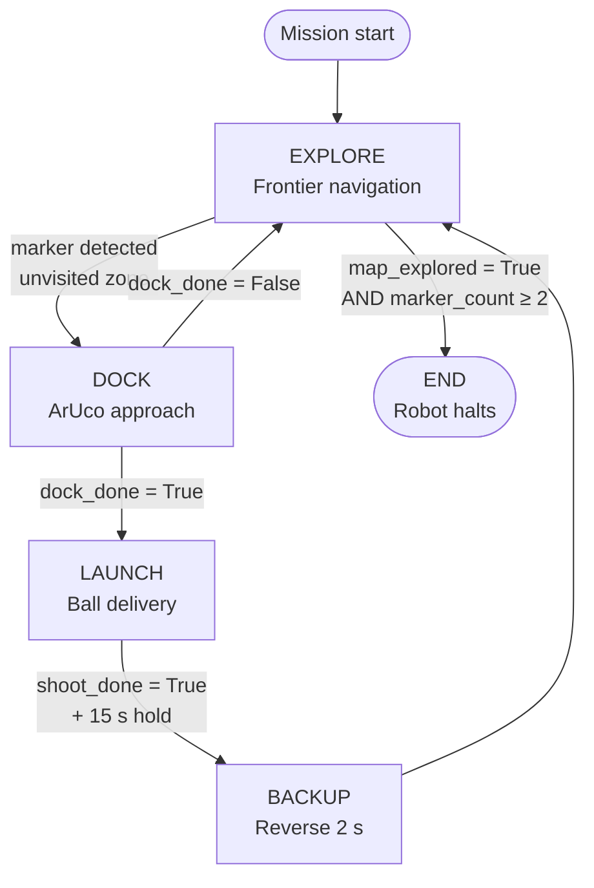
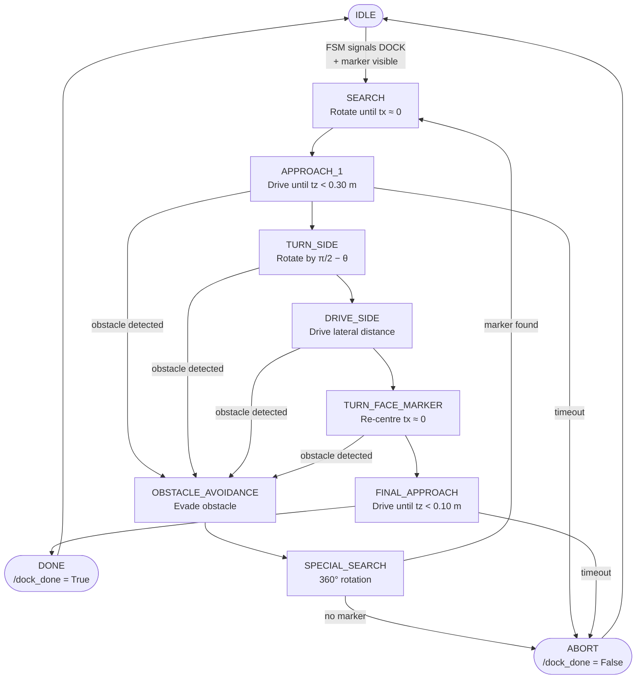
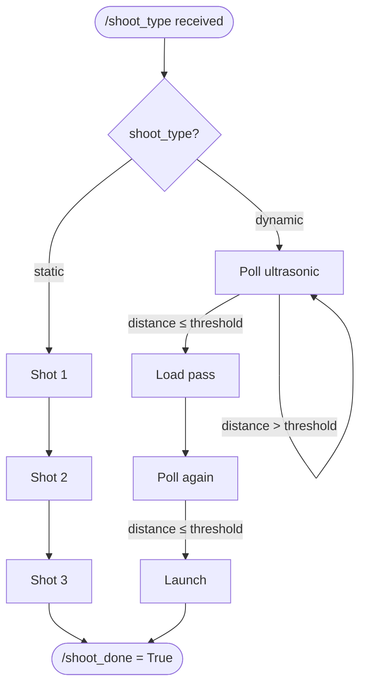

## 🔗 Navigation

- [Home](index.md)
- [Requirements Specification](requirements-specification.md)
- [Concept of Operations](con-ops.md)
- [High Level Design](high-level-design.md)
- [Software Subsystem: Navigation and FSM](subsystem-nav-fsm.md)
- [Software Subsystem: ArUco Marker Detection](subsystem-software-aruco.md)
- [Mechanical Subsystem](subsystem-mechanical.md)
- [Electrical Subsystem](subsystem-electrical.md)
- [Interface Control Document](interface-control-document.md)
- [Software and Firmware Development](software-firmware-development.md)
- [Testing Documentation](testing-documentation.md)
- [User Manual](user-manual.md)
- [Areas for Improvement](improvements.md)
- [Appendix](appendix.md)

---

# High Level Design

## System Overview

The system is a ROS 2 Humble-based autonomous mobile robot (AMR) built on a TurtleBot3 Burger platform. It is split across two compute nodes: a **remote laptop** running the mission orchestration, SLAM, and navigation stack, and an **on-board Raspberry Pi 4** handling camera processing, docking control, and hardware actuation.

The five core subsystems — Navigation & SLAM, Finite State Machine (FSM), ArUco Marker Detection, Docking Controller, and Shooter Controller — run as independent ROS 2 nodes and communicate exclusively through published topics. No direct function calls cross subsystem boundaries.

---

## Deployment Architecture

The system compute is split between two hosts. The laptop handles all heavy processing; the Pi handles all hardware-facing tasks.

### Remote Laptop (Ubuntu 22.04)

- SLAM Toolbox → Generates `/map` for navigation  
- exploration_controller → Frontier exploration, A* path planning, pure pursuit tracking  
- fsm_controller → Mission state management and velocity multiplexing  
- RViz → Visualisation of map, robot pose, and paths  

### On-board Raspberry Pi 4

- aruco_pose_streamer → ArUco marker detection and TF pose publishing  
- docking_controller → Marker-guided docking control  
- shooter_controller → Launcher actuation and ultrasonic sensing  
- Sensors → Camera and LiDAR inputs  

### Communication

- All nodes communicate using ROS 2 DDS over Wi-Fi  
- No direct function calls between subsystems  
- All data exchange occurs via ROS 2 topics  

---

| Layer | Host | Responsibilities |
|---|---|---|
| **Laptop** | Remote PC (Ubuntu 22.04) | SLAM Toolbox, `exploration_controller`, `fsm_controller`, RViz visualisation |
| **Robot** | Raspberry Pi 4 (on-board) | `aruco_pose_streamer`, `docking_controller`, `shooter_controller`, camera + LiDAR |
---

## Runtime Components

| Node | Host | Role |
|---|---|---|
| `exploration_controller` | Laptop | Frontier-based exploration, A\* path planning, pure-pursuit tracking |
| `fsm_controller` | Laptop | Top-level mission state machine and velocity multiplexer |
| `aruco_pose_streamer` | Pi | ArUco marker detection and TF pose broadcast |
| `docking_controller` | Pi | Multi-stage marker-guided docking state machine |
| `shooter_controller` | Pi | Rack-and-pinion ball delivery, ultrasonic sensing, GPIO actuation |
| SLAM Toolbox | Laptop | Real-time 2D occupancy grid construction and localisation |
| RViz | Laptop | Live map, robot pose, and path visualisation |

---

## ROS 2 Data Flow

The diagram below shows how sensor data flows through all nodes to the motors, and how status signals feed back to the FSM.

---

## Mission State Flow

---

## Subsystem Descriptions

### Navigation & SLAM

The `exploration_controller` node implements autonomous frontier-based exploration. On each planning cycle it:

1. Receives the occupancy grid from `/map` and inflates walls by `expansion_size` cells to create a costmap.
2. Identifies frontier cells — free cells (`0`) adjacent to unknown cells (`-1`) — using a breadth-first scan.
3. Groups contiguous frontier cells using DFS and selects the top 5 largest groups.
4. Scores each group by `frontier_size / path_distance` and selects the highest-scoring reachable group.
5. Plans an A\* path from the robot's current grid cell to the frontier centroid, then fits a B-spline for smooth traversal.
6. Tracks the path using a pure-pursuit controller with a configurable lookahead distance.
7. Layers local obstacle avoidance on top: LiDAR scan sectors detect obstacles within `robot_r` and override path-following with evasive velocity commands.

When no frontier groups remain, `/map_explored = True` is published and exploration halts.

### Finite State Machine (FSM)

The `fsm_controller` node is the mission arbiter. It maintains the top-level state and acts as a **velocity multiplexer**, forwarding the correct controller's `Twist` output to `/cmd_vel` depending on the active state.

**Velocity multiplexing:**

| FSM State | Source published to `/cmd_vel` |
|---|---|
| `EXPLORE` | `/cmd_vel_nav` (exploration controller) |
| `DOCK` | `/cmd_vel_docking` (docking controller) |
| `BACKUP` | Hard-coded reverse: `linear.x = -0.1 m/s` |
| `LAUNCH`, `END` | Zero velocity (`Twist()`) |

### ArUco Marker Detection

The `aruco_pose_streamer` node runs on the Pi and processes every camera frame:

1. Converts ROS 2 `Image` messages to OpenCV `BGR` frames via `cv_bridge`.
2. Detects ArUco markers using `DICT_4X4_250` and `DetectorParameters`.
3. Estimates 6-DOF pose using `cv2.aruco.estimatePoseSingleMarkers` with camera intrinsics from `/camera/camera_info` (fallback pinhole model if intrinsics are invalid).
4. Broadcasts each detected marker's pose as a TF transform (`aruco_marker_<id>`).
5. Publishes `/marker_detected = True` (deduplicated — only published on state change).

Zone identification: marker ID `0` → `static` zone, marker ID `1` → `dynamic` zone.

### Docking Controller

The `docking_controller` node executes a geometric perpendicular docking manoeuvre guided by the ArUco marker's `tvec` and `rvec`.

Key geometric logic in `APPROACH_1` → `TURN_SIDE`:

- Computes angle `θ` between the marker normal and the camera→marker vector using the marker's rotation matrix.
- Plans a lateral step of distance `tz × sin(θ)` to reach the perpendicular line.
- Turns by `(π/2 − |θ|)` to face perpendicular, drives the lateral distance, then turns back to face the marker.

**Watchdog timers** (both trigger `ABORT`):
- Marker invisible for > **30 seconds** continuously.
- Any single docking state active for > **45 seconds**.

### Shooter Controller

The `shooter_controller` node manages ball delivery via two servos and one ultrasonic sensor connected to the Pi's GPIO through `pigpio`:

| Component | GPIO Pin | Function |
|---|---|---|
| Gate servo | Pin 12 | Opens/closes to release one ball |
| Rack servo | Pin 13 | Continuous rotation — pulls back the launcher rack |
| Ultrasonic trigger | Pin 23 | HC-SR04 trigger pulse |
| Ultrasonic echo | Pin 24 | HC-SR04 echo return |

Ultrasonic distance is computed as a **median of 5 samples**, filtering out readings outside `[0.02 m, 4.0 m]`. Speed of sound is corrected for ambient temperature (`331.3 + 0.606 × T °C` m/s).

---

## ROS 2 Topic Summary

| Topic | Type | Publisher | Subscriber(s) |
|---|---|---|---|
| `/scan` | `LaserScan` | LiDAR driver | `exploration_controller`, `docking_controller` |
| `/odom` | `Odometry` | TurtleBot3 bringup | `exploration_controller`, `docking_controller` |
| `/map` | `OccupancyGrid` | SLAM Toolbox | `exploration_controller` |
| `/camera/image_raw` | `Image` | Camera node | `aruco_pose_streamer` |
| `/camera/camera_info` | `CameraInfo` | Camera node | `aruco_pose_streamer` |
| `/tf` | `TFMessage` | `aruco_pose_streamer` | `docking_controller`, `fsm_controller` |
| `/marker_detected` | `Bool` | `aruco_pose_streamer` | `fsm_controller` |
| `/cmd_vel_nav` | `Twist` | `exploration_controller` | `fsm_controller` |
| `/cmd_vel_docking` | `Twist` | `docking_controller` | `fsm_controller` |
| `/cmd_vel` | `Twist` | `fsm_controller` | TurtleBot3 motor driver |
| `/states` | `String` | `fsm_controller` | `docking_controller` |
| `/dock_done` | `Bool` | `docking_controller` | `fsm_controller` |
| `/shoot_type` | `String` | `fsm_controller` | `shooter_controller` |
| `/shoot_done` | `Bool` | `shooter_controller` | `fsm_controller` |
| `/map_explored` | `Bool` | `exploration_controller` | `fsm_controller` |
| `/exploration_path` | `Path` | `exploration_controller` | RViz |

---

## Design Rationale

**Decoupled subsystems via topics** — each node publishes and subscribes to well-defined topics. This allows any subsystem to be swapped, tested in isolation, or replaced without modifying other nodes.

**Laptop/Pi compute split** — SLAM and A\* are CPU-intensive; keeping them on the laptop prevents the Pi from becoming a bottleneck during real-time marker detection and GPIO actuation.

**Velocity multiplexer in FSM** — rather than having multiple nodes write directly to `/cmd_vel`, the FSM acts as a single gatekeeper. This prevents conflicting velocity commands and makes the priority logic explicit and auditable.

**Watchdog timers in docking** — the 30-second marker-loss watchdog and 45-second per-state watchdog ensure the robot never stalls indefinitely in a partially completed docking attempt, always returning to a known safe state (`ABORT` → `IDLE`).

**Parameter-driven configuration** — all thresholds, speeds, pin assignments, and timing values are exposed as ROS 2 parameters loaded from `params.yaml` at launch. No magic numbers exist in business logic, making tuning and re-calibration straightforward.

**Simulation parity** — the `enable_hardware = False` flag on the shooter node and standard Gazebo-compatible topic names mean the full software stack can be validated in simulation before any hardware run.
