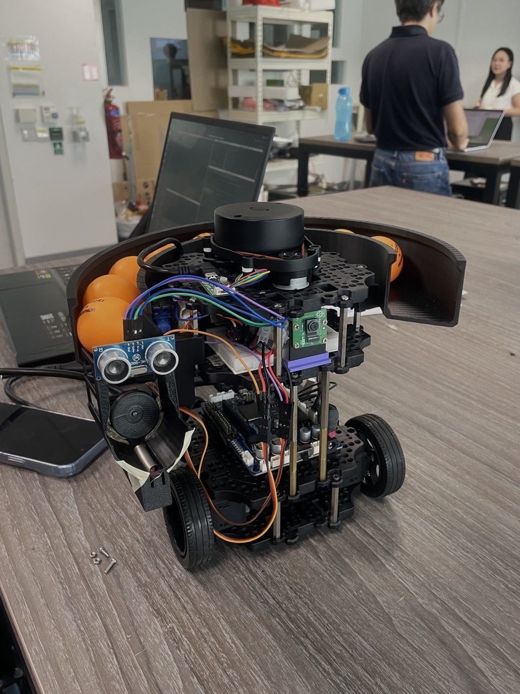
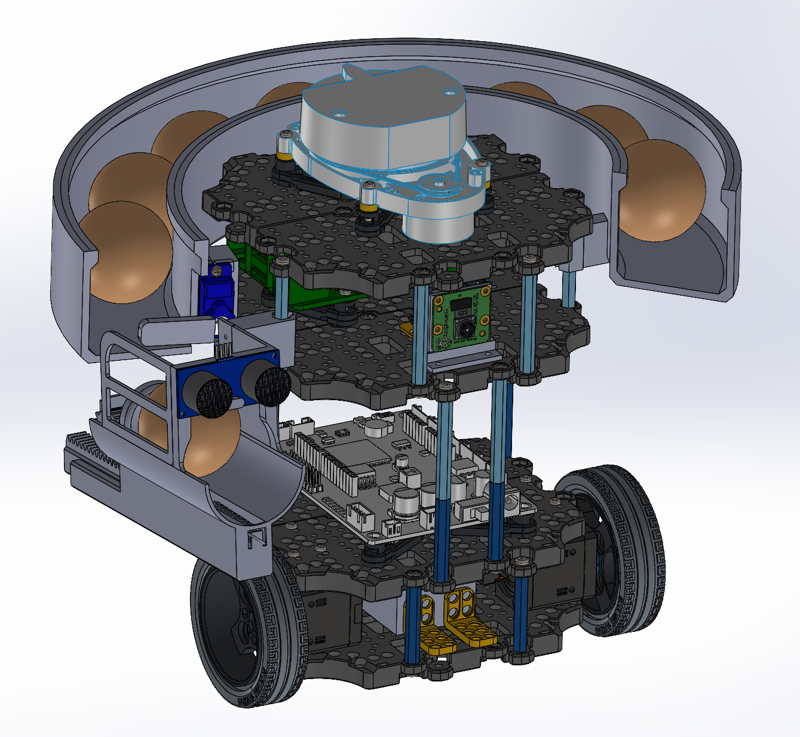
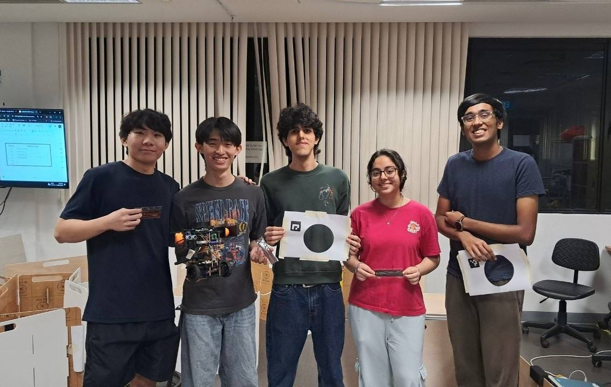

# Fundamentals of System Design – CDE2310

## System Overview

This project is a ROS2-based autonomous mission stack using LiDAR, RPi Camera & Rack-and-Pinion Spring-Loaded Launcher for a warehouse maze environment deployment.

Tech stack:

- ROS2 Humble
- SLAM Toolbox
- Custom Open-source ROS2 Frontier-based exploration
- OpenCV ArUco marker detection
- Python / C++

Core subsystems:

- Navigation and FSM orchestration
- Docking at static and dynamic delivery zones via ArUco marker detection
- 3D-printed Spring-loaded rack-and-pinion launcher system
- Fully simulated in Gazebo
- Successful static and dynamic ball delivery and autonomous exploration & navigation of warehouse maze environment

## 🔗 Navigation

- [Home](index.md)
- [Requirements Specification](requirements-specification.md)
- [Concept of Operations](con-ops.md)
- [High Level Design](high-level-design.md)
- [Software Subsystem: Navigation and FSM](subsystem-nav-fsm.md)
- [Software Subsystem: ArUco Marker Detection](subsystem-software-aruco.md)
- [Mechanical Subsystem](subsystem-mechanical.md)
- [Electrical Subsystem](subsystem-electrical.md)
- [Interface Control Document](interface-control-document.md)
- [Software and Firmware Development](software-firmware-development.md)
- [Testing Documentation](testing-documentation.md)
- [User Manual](user-manual.md)
- [Areas for Improvement](improvements.md)
- [Appendix](appendix.md)

---

## Our Robot

  
   

## Final Navigation Run (Sped Up)

  <video width='780' height='480' controls>
    <source src="assets/rviz.mp4" type="video/mp4">
    Your browser does not support the video tag.
  </video>

## Full Mission Run:
[Watch the Video](https://youtu.be/GBjxFKn8IDs)

## The Team

  

