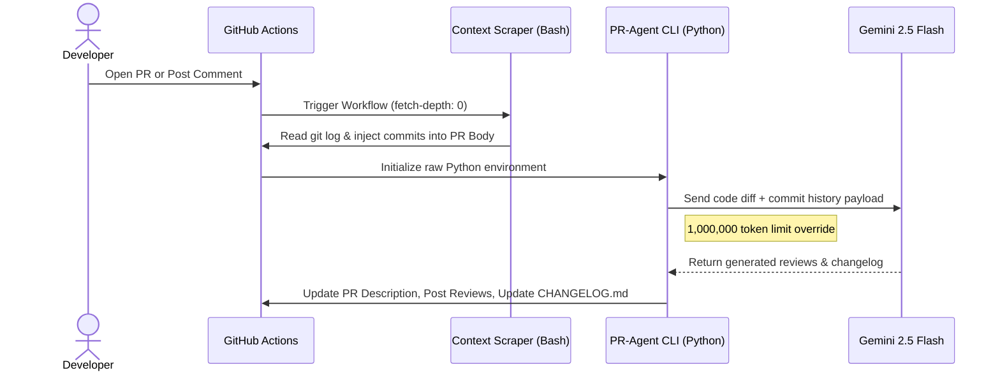

## 🔗 Navigation

- [Home](index.md)
- [Requirements Specification](requirements-specification.md)
- [Concept of Operations](con-ops.md)
- [High Level Design](high-level-design.md)
- [Software Subsystem: Navigation and FSM](subsystem-nav-fsm.md)
- [Software Subsystem: ArUco Marker Detection](subsystem-software-aruco.md)
- [Mechanical Subsystem](subsystem-mechanical.md)
- [Electrical Subsystem](subsystem-electrical.md)
- [Interface Control Document](interface-control-document.md)
- [Software and Firmware Development](software-firmware-development.md)
- [Testing Documentation](testing-documentation.md)
- [User Manual](user-manual.md)
- [Areas for Improvement](improvements.md)
- [Appendix](appendix.md)

---

# Software and Firmware Development

## Document Purpose

This is the **practical guide for development and deployment**: build instructions, workspace setup, launch sequences with examples, runtime configuration, and troubleshooting. This document answers HOW to work with the system.

**References to specification documents:**
- [interface-control-document.md](interface-control-document.md) - Complete reference of all ROS topics, launch arguments, and timing specifications
- [subsystem-nav-fsm.md](subsystem-nav-fsm.md) - Navigation and FSM subsystem design documentation

## Build Environment

- ROS2 Humble
- TurtleBot3 workspace at `~/turtlebot3_ws`
- Python 3 tooling for launch and runtime scripts
- Runtime dependencies: `slam_toolbox`, `turtlebot3`, `turtlebot3_gazebo`, `opencv-python`

## Prerequisites

- TurtleBot3 Burger with camera sensor for marker detection and real-robot validation
- A laptop with ROS2 Humble and workspace access
- Raspberry Pi side robot bringup available for hardware runs

## Versioning and Release Notes

- Use semantic versioning for package and docs releases.

## CHANGELOG Reference

- `CHANGELOG.md` is the repository-level version-history reference.
- Keep it as a read-only artifact for documentation purposes.


## CI and Agentic Changelog Pipeline

Pull-request documentation validation is defined in `.github/workflows/docs-build.yml`.
Documentation site deployment is defined in `.github/workflows/docs-pages.yml`.

This repository uses a custom CI pipeline powered by [Qodo PR-Agent](https://github.com/qodo-ai/pr-agent) and Google's **Gemini 2.5 Flash** model to automate pull request management and documentation, standardize our release documentation, enforce Semantic Versioning (SemVer 2.0.0), and reduce administrative overhead. 

Whenever a new Pull Request is opened, the pipeline automatically executes the following suite:
1. **Hardware-Aware Commit Scraping:** Bypasses Git's "binary blindspot" by scraping local git history to document physical CAD changes (`.SLDPRT`, `.STL`, etc.) before the AI runs.
2. **Auto-Describe:** Analyzes the code diff and commit history to automatically write a comprehensive PR Title and Description.
3. **Auto-Review & Improve:** Scans the code for bugs and leaves actionable, inline code suggestions.
4. **Auto-Changelog:** Generates a strict, version-bumped `CHANGELOG.md` block based on your branch's features and fixes.


### Developer Workflow

Developers must follow this workflow when merging code into the `main` branch.

#### 1. Write Conventional Commits
Make sure you are editing on your **LOCAL BRANCH** and not the `main` branch!

The AI agent calculates the next version number strictly based on the prefixes used in your commit messages and PR title. You **must** use one of the following prefixes:

* `feat: ` (New features, architectural additions, nodes. 'MAJOR' is to be included in the commit message for MAJOR versioning, else it defaults to MINOR versioning)
* `fix: ` (Bug fixes, path resolutions, logic errors)
* `docs: ` (Updates to README, comments, or documentation)
* `test: ` (Adding or updating tests/simulations)

for hardware/CAD changes: **BE DESCRIPTIVE** in your commit messages as the CHANGELOG.md will be updated based on your commit messages.

*Example: `feat(navigation): integrate frontier exploration algorithm`*

#### 2. Open a Pull Request

Push your code to your **LOCAL BRANCH** and push that branch to GitHub.
```bash
git push origin [local_branch_name]
```
Open a Pull Request against `main`. 
if you have Github CLI:
```bash
gh pr create --fill
```
(auto-fills latest commit message as title)
* **The Auto-Review & changelog update:** The GitHub Action will immediately wake up, analyze your code diffs, and post a summary of your changes as a comment on the PR. **VERIFY** the documentation on your own and make necessary edits.

**Manual Commands:**
If you need the AI to re-run a specific task, you can type any of these commands as a standard comment in your Pull Request thread:
* `/update_changelog` - Regenerates the changelog.
* `/describe` - Regenerates the PR description.
* `/review` - Re-runs the high-level review.
* `/improve` - Scans for new inline code improvements.
* `/ask [question]` - Ask the AI a specific question about the PR's code.

### AI Pipeline Architecture

This repository utilizes a highly customized, hardware-aware CI/CD pipeline, reads binary CAD diffs (e.g., SolidWorks, STL files) by using a pre-processing commit scraper combined with a native Python implementation of [Qodo PR-Agent](https://github.com/qodo-ai/pr-agent), powered by **Google Gemini 2.5 Flash**.

#### Data Flow Diagram



## Workspace Setup

1. Clone the repository into the ROS workspace:

```bash
cd ~/turtlebot3_ws/src
git clone https://github.com/Kmyming/CDE2310_G10_2526.git CDE2310_G10_2526
cd ~/turtlebot3_ws
```

2. Build `auto_explore` with colcon:

```bash
colcon build --packages-select auto_explore
source install/setup.bash
```

3. Verify package discovery:

```bash
ros2 pkg list | grep auto_explore
```

Expected output:

```text
auto_explore
```

## Package Layout

- `remote_laptop_src/launch/`
- `remote_laptop_src/auto_explore/auto_explore/`
- `remote_laptop_src/config/`

## Build and Run Workflow

- Use `global_bringup.py` for integrated mission startup.
- Use `global_controller_bringup.py` for controller-only bringup.
- Use `nav_bringup.py` for navigation-only bringup.

## Additional Setup (Real Robot)

### Laptop shooter dependency

Install pigpio Python client on the laptop and the Raspberry Pi:

```bash
pip3 install pigpio
```

### Raspberry Pi boot-time prerequisites

The Pi should run pigpiod and show its IP at boot.

Add these commands to `~/.bashrc` on the Raspberry Pi during setup:

```bash
cat >> ~/.bashrc << 'EOF'
sudo pigpiod
hostname -I
EOF

source ~/.bashrc
```

### Cleanup scripts setup

#### laptop cleanup script:
Create the cleanup script in the laptop home directory and then add the alias to `~/.bashrc`.

1. Create `~/cleanup_duplicate_drivers.sh` in the home directory with the following content:

```bash
cat > ~/cleanup_duplicate_drivers.sh << 'EOF'
#!/bin/bash
# cleanup_duplicate_drivers.sh
# Removes duplicate turtlebot3 driver processes that cause queue-full errors
# Run this BEFORE launching the system with 'start' command

set -e

echo "=========================================="
echo "TurtleBot3 Duplicate Driver Cleanup"
echo "=========================================="
echo ""

echo "[1/5] Checking for duplicate launches on robot..."
DUPLICATE_COUNT=$(sshrp "ps aux | grep robot.launch.py | grep -v grep | wc -l" 2>/dev/null || echo "0")

if [ "$DUPLICATE_COUNT" -le 0 ]; then
    echo "     ✓ No duplicate launches found - system is clean"
else
    echo "     ⚠ Found $DUPLICATE_COUNT launch instances (should be 1 or 0)"
fi

echo ""
echo "[2/5] Stopping all robot launch processes remotely..."
sshrp "pkill -9 -f 'robot.launch.py' 2>/dev/null && echo '      Launches stopped'" || true
sleep 1

echo ""
echo "[3/5] Cleaning up driver processes (ld08_driver, robot_state_publisher, v4l2_camera)..."
sshrp "pkill -9 -f 'ld08_driver|robot_state_publisher|v4l2_camera' 2>/dev/null && echo '      Drivers cleaned'" || true
sleep 2

echo ""
echo "[4/5] Restarting ROS daemon on laptop for clean graph..."
ros2 daemon stop >/dev/null 2>&1 || true
sleep 1
ros2 daemon start >/dev/null 2>&1
echo "      ✓ Daemon restarted"

echo ""
echo "[5/5] Verifying cleanup - checking ROS node graph..."
NODE_COUNT=$(ros2 node list 2>&1 | wc -l)

if ros2 node list 2>&1 | grep -q "nodes in the graph that share an exact name"; then
    echo "      ⚠ WARNING: Still detected duplicate node names"
    echo ""
    echo "Current nodes:"
    ros2 node list 2>&1 | tail -n +2
else
    echo "      ✓ Node graph is clean (no duplicate warnings)"
    if [ "$NODE_COUNT" -gt 1 ]; then
        echo ""
        echo "Active nodes:"
        ros2 node list 2>&1 | grep -v WARNING || true
    fi
fi

echo ""
echo "=========================================="
echo "Cleanup Complete!"
echo "=========================================="
echo ""
echo "Next step: Run 'start <robot_ip>' to launch the system"
echo "Example:   start 172.20.10.5"
echo ""
EOF
```

2. Make the script executable:

```bash
chmod +x ~/cleanup_duplicate_drivers.sh
```

3. Add the alias to the laptop `~/.bashrc`:

```bash
alias cleanup='~/cleanup_duplicate_drivers.sh'
```

4. Reload the shell configuration:

```bash
source ~/.bashrc
```

This script depends on the `sshrp` alias already defined in the laptop `~/.bashrc`, because it uses that alias to reach the Raspberry Pi and stop duplicate robot-side driver processes.

#### RPi cleanup script:

Set up an RPi-side cleanup command so `rosbustop` can be run as a normal bash command.

1. Create the cleanup script in the RPi home directory:

```bash
cat > ~/rosbu_cleanup.sh << 'EOF'
#!/bin/bash
# rosbu_cleanup.sh
# Force-clean TurtleBot3 bringup and camera stacks on RPi

set +e

echo "=========================================="
echo "RPi ROS Bringup/Camera Cleanup (rosbustop)"
echo "=========================================="

TARGET_PATTERNS=(
    "robot.launch.py"
    "ld08_driver"
    "robot_state_publisher"
    "turtlebot3_ros"
    "v4l2_camera_node"
)

echo "[1/4] Killing process groups for bringup/camera targets..."
for pattern in "${TARGET_PATTERNS[@]}"; do
    for pid in $(pgrep -f "$pattern" 2>/dev/null); do
        pgid=$(ps -o pgid= -p "$pid" 2>/dev/null | tr -d ' ')
        if [ -n "$pgid" ]; then
            kill -TERM -- -"$pgid" 2>/dev/null || true
            sleep 0.05
            kill -KILL -- -"$pgid" 2>/dev/null || true
        fi
    done
done

echo "[2/4] Killing child camera processes..."
for cam_parent in $(pgrep -f "v4l2_camera|camera" 2>/dev/null); do
    pkill -TERM -P "$cam_parent" 2>/dev/null || true
    sleep 0.05
    pkill -KILL -P "$cam_parent" 2>/dev/null || true
done

echo "[3/4] Fallback TERM/KILL sweep by process name..."
for pattern in "${TARGET_PATTERNS[@]}"; do
    pkill -TERM -f "$pattern" 2>/dev/null || true
done
sleep 0.2
for pattern in "${TARGET_PATTERNS[@]}"; do
    pkill -KILL -f "$pattern" 2>/dev/null || true
done

echo "[4/4] Cleanup complete. Remaining matching processes (if any):"
for pattern in "${TARGET_PATTERNS[@]}"; do
    pgrep -af "$pattern" 2>/dev/null || true
done

echo "Done: bringup and camera processes force-cleaned."
EOF
```

2. Make the script executable:

```bash
chmod +x ~/rosbu_cleanup.sh
```

3. Add the alias to `~/.bashrc` on the RPi:

```bash
echo "alias rosbustop='~/rosbu_cleanup.sh'" >> ~/.bashrc
```

4. Reload shell config:

```bash
source ~/.bashrc
```

5. Verify command registration:

```bash
type rosbustop
```

6. Run cleanup before relaunching bringup/camera stacks:

```bash
rosbustop
```

### Real-robot launch alias setup

Reusable shell helper:

```bash
cat >> ~/.bashrc << 'EOF'
start () {
    if [ -z "$1" ]; then
        read -rp "Pi IP: " PI_IP
    else
        PI_IP="$1"
    fi

    if [ -z "$2" ]; then
        MARKERS_ENABLED="true"
    else
        MARKERS_ENABLED="$2"
    fi

    if [ -z "$3" ]; then
        POSE_PUBLISHER_ENABLED="true"
    else
        POSE_PUBLISHER_ENABLED="$3"
    fi

    # Reset potentially stale overlays before launching.
    unset AMENT_PREFIX_PATH COLCON_PREFIX_PATH CMAKE_PREFIX_PATH PYTHONPATH
    source /opt/ros/humble/setup.bash
    source ~/turtlebot3_ws/install/local_setup.bash

    # Prevent RViz from picking incompatible snap libc/pthread shims.
    unset LD_PRELOAD
    if [ -n "$LD_LIBRARY_PATH" ]; then
        export LD_LIBRARY_PATH="$(printf '%s' "$LD_LIBRARY_PATH" | tr ':' '\n' | grep -v '^/snap/core20/current/lib' | paste -sd: -)"
    fi

    # Prevent duplicate local controller nodes from prior interrupted launches.
    pkill -f '/auto_explore/mission_controller|/auto_explore/exploration_controller|/auto_explore/pose_publisher|/auto_explore/docking_controller|/auto_explore/shooter_controller' >/dev/null 2>&1 || true

    ros2 daemon stop >/dev/null 2>&1 || true
    ros2 daemon start >/dev/null 2>&1

    ros2 launch auto_explore global_bringup.py \
        use_sim_time:=false \
        enable_slam:=true \
        enable_rviz:=true \
        enable_markers:=true \
        enable_pose_publisher:=true \
        enable_docking:=true \
        enable_shooter:=true \
        shooter_enable_hardware:=true \
        shooter_pigpiod_host:="$PI_IP"
}
EOF

source ~/.bashrc
```

### Rebuild after edits

If launch or config changes do not appear:

```bash
cd ~/turtlebot3_ws
source /opt/ros/humble/setup.bash
colcon build --packages-select auto_explore
source install/setup.bash
```

## Launch Sequences

Operational launch sequences are maintained in the user-facing runbook: `docs/user-manual.md`.

## Launch Arguments by Layer

### Top-level integrated launcher (`global_bringup.py`)

- `use_sim_time`
- `enable_slam`
- `enable_rviz`
- `slam_params_file`
- `enable_fsm`
- `enable_navigation`
- `enable_markers`
- `enable_pose_publisher`
- `enable_docking`
- `enable_shooter`
- `shooter_enable_hardware`

### Controller launcher (`global_controller_bringup.py`)

Includes all controller toggles and shooter tuning arguments:

- `shooter_pigpiod_host`
- `shooter_pigpiod_port`
- `shooter_ultrasonic_trigger_pin`
- `shooter_ultrasonic_echo_pin`
- `shooter_ultrasonic_distance_threshold_m`
- `shooter_ultrasonic_simulated_distance_m`
- `shooter_engage_profile`

### Navigation launcher (`nav_bringup.py`)

- `use_sim_time`
- `enable_slam`
- `enable_rviz`
- `slam_params_file`
- `slam_start_delay_sec`
- `rviz_start_delay_sec`

## RViz Configuration Update

```bash
cp ~/turtlebot3_ws/src/turtlebot3/turtlebot3_cartographer/rviz/tb3_cartographer.rviz ~/tb3_cartographer.rviz.backup
nano ~/turtlebot3_ws/src/turtlebot3/turtlebot3_cartographer/rviz/tb3_cartographer.rviz
```

Use the team-approved RViz file content for the cartographer view in Appendix A. Verify with:

```bash
rviz2 -d ~/turtlebot3_ws/src/turtlebot3/turtlebot3_cartographer/rviz/tb3_cartographer.rviz
```

## Launch Components

The integrated bringup includes:

- SLAM Toolbox
- RViz visualization
- Mission FSM
- Exploration controller
- ArUco pose publisher


## Configuration Management

- Describe the SLAM and navigation parameter files.
- Record which settings are source-of-truth and where they live.