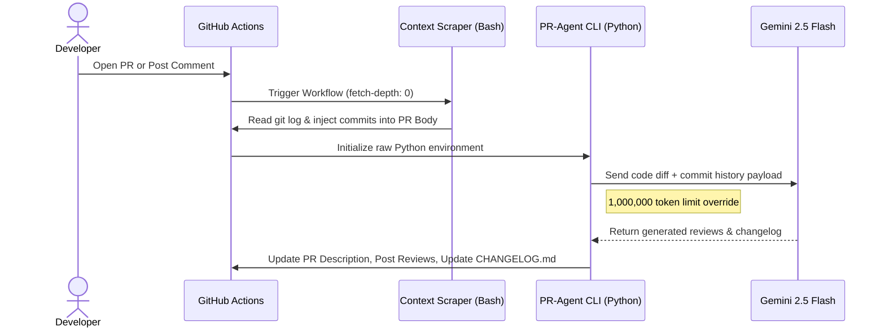

# 🔗 Navigation

- [Home](index.md)
- [Requirements Specification](requirements-specification.md)
- [Concept of Operations](con-ops.md)
- [High Level Design](high-level-design.md)
- [Software Subsystem: Navigation and FSM](subsystem-nav-fsm.md)
- [Software Subsystem: ArUco Marker Detection](subsystem-software-aruco.md)
- [Mechanical Subsystem](subsystem-mechanical.md)
- [Electrical Subsystem](subsystem-electrical.md)
- [Interface Control Document](interface-control-document.md)
- [Software and Firmware Development](software-firmware-development.md)
- [Testing Documentation](testing-documentation.md)
- [User Manual](user-manual.md)
- [Areas for Improvement](improvements.md)
- [Appendix](appendix.md)

---

# Software and Firmware Development

## Document Purpose

This is the **practical guide for development and deployment**: build instructions, workspace setup, launch sequences with examples, runtime configuration, and troubleshooting. This document answers HOW to work with the system.

**References to specification documents:**
- [interface-control-document.md](interface-control-document.md) - Complete reference of all ROS topics, launch arguments, and timing specifications
- [subsystem-nav-fsm.md](subsystem-nav-fsm.md) - Navigation and FSM subsystem design documentation

## Build Environment

- ROS2 Humble
- TurtleBot3 workspace at `~/turtlebot3_ws`
- Python 3 tooling for launch and runtime scripts
- Runtime dependencies: `slam_toolbox`, `turtlebot3`, `turtlebot3_gazebo`, `opencv-python`

## Prerequisites

- TurtleBot3 Burger with camera sensor for marker detection and real-robot validation
- A laptop with ROS2 Humble and workspace access
- Raspberry Pi side robot bringup available for hardware runs

## Versioning and Release Notes

- Use semantic versioning for package and docs releases.

## CHANGELOG Reference

- `CHANGELOG.md` is the repository-level version-history reference.
- Keep it as a read-only artifact for documentation purposes.


## CI and Agentic Changelog Pipeline

Pull-request documentation validation is defined in `.github/workflows/docs-build.yml`.
Documentation site deployment is defined in `.github/workflows/docs-pages.yml`.

This repository uses a custom CI pipeline powered by [Qodo PR-Agent](https://github.com/qodo-ai/pr-agent) and Google's **Gemini 2.5 Flash** model to automate pull request management and documentation, standardize our release documentation, enforce Semantic Versioning (SemVer 2.0.0), and reduce administrative overhead. 

Whenever a new Pull Request is opened, the pipeline automatically executes the following suite:
1. **Hardware-Aware Commit Scraping:** Bypasses Git's "binary blindspot" by scraping local git history to document physical CAD changes (`.SLDPRT`, `.STL`, etc.) before the AI runs.
2. **Auto-Describe:** Analyzes the code diff and commit history to automatically write a comprehensive PR Title and Description.
3. **Auto-Review & Improve:** Scans the code for bugs and leaves actionable, inline code suggestions.
4. **Auto-Changelog:** Generates a strict, version-bumped `CHANGELOG.md` block based on your branch's features and fixes.


### Developer Workflow

Developers must follow this workflow when merging code into the `main` branch.

#### 1. Write Conventional Commits
Make sure you are editing on your **LOCAL BRANCH** and not the `main` branch!

The AI agent calculates the next version number strictly based on the prefixes used in your commit messages and PR title. You **must** use one of the following prefixes:

* `feat: ` (New features, architectural additions, nodes. 'MAJOR' is to be included in the commit message for MAJOR versioning, else it defaults to MINOR versioning)
* `fix: ` (Bug fixes, path resolutions, logic errors)
* `docs: ` (Updates to README, comments, or documentation)
* `test: ` (Adding or updating tests/simulations)

for hardware/CAD changes: **BE DESCRIPTIVE** in your commit messages as the CHANGELOG.md will be updated based on your commit messages.

*Example: `feat(navigation): integrate frontier exploration algorithm`*

#### 2. Open a Pull Request

Push your code to your **LOCAL BRANCH** and push that branch to GitHub.
```bash
git push origin [local_branch_name]
```
Open a Pull Request against `main`. 
if you have Github CLI:
```bash
gh pr create --fill
```
(auto-fills latest commit message as title)
* **The Auto-Review & changelog update:** The GitHub Action will immediately wake up, analyze your code diffs, and post a summary of your changes as a comment on the PR. **VERIFY** the documentation on your own and make necessary edits.

**Manual Commands:**
If you need the AI to re-run a specific task, you can type any of these commands as a standard comment in your Pull Request thread:
* `/update_changelog` - Regenerates the changelog.
* `/describe` - Regenerates the PR description.
* `/review` - Re-runs the high-level review.
* `/improve` - Scans for new inline code improvements.
* `/ask [question]` - Ask the AI a specific question about the PR's code.

### AI Pipeline Architecture

This repository utilizes a highly customized, hardware-aware CI/CD pipeline, reads binary CAD diffs (e.g., SolidWorks, STL files) by using a pre-processing commit scraper combined with a native Python implementation of [Qodo PR-Agent](https://github.com/qodo-ai/pr-agent), powered by **Google Gemini 2.5 Flash**.

#### Data Flow Diagram



## Workspace Setup

1. Clone the repository into the ROS workspace:

```bash
cd ~/turtlebot3_ws/src
git clone https://github.com/Kmyming/CDE2310_G10_2526.git CDE2310_G10_2526
cd ~/turtlebot3_ws
```

2. Build `auto_explore` with colcon:

```bash
colcon build --packages-select auto_explore
source install/setup.bash
```

3. Verify package discovery:

```bash
ros2 pkg list | grep auto_explore
```

Expected output:

```text
auto_explore
```

## Package Layout

- `remote_laptop_src/launch/`
- `remote_laptop_src/auto_explore/auto_explore/`
- `remote_laptop_src/config/`

## Build and Run Workflow

- Use `global_bringup.py` for integrated mission startup.
- Use `global_controller_bringup.py` for controller-only bringup.
- Use `nav_bringup.py` for navigation-only bringup.

## Additional Setup (Real Robot)

### Laptop shooter dependency

Install pigpio Python client on the laptop:

```bash
pip3 install pigpio
```

### Raspberry Pi boot-time prerequisites

The Pi should run pigpiod and show its IP at boot.

If needed, run:

```bash
sudo pigpiod
hostname -I
```

### Real-robot shooter launch rule

Copy the Pi IP shown at boot and pass it to `shooter_pigpiod_host`.

Direct command:

```bash
ros2 launch auto_explore global_controller_bringup.py use_sim_time:=false \
	enable_fsm:=true enable_navigation:=true enable_markers:=true \
	enable_pose_publisher:=true enable_docking:=true enable_shooter:=true \
	shooter_enable_hardware:=true shooter_pigpiod_host:=<PI_IP_FROM_BOOT>
```

Reusable shell helper:

```bash
cat >> ~/.bashrc << 'EOF'
start () {
	if [ -z "$1" ]; then
		echo "Usage: start <PI_IP>"
		return 1
	fi

	ros2 launch auto_explore global_controller_bringup.py use_sim_time:=false \
		enable_fsm:=true enable_navigation:=true enable_markers:=true \
		enable_pose_publisher:=true enable_docking:=true enable_shooter:=true \
		shooter_enable_hardware:=true shooter_pigpiod_host:="$1"
}
EOF

source ~/.bashrc
```

### Rebuild after edits

If launch or config changes do not appear:

```bash
cd ~/turtlebot3_ws
source /opt/ros/humble/setup.bash
colcon build --packages-select auto_explore
source install/setup.bash
```

## Launch Sequences (Verified)

### Gazebo Simulation (Full Mission Stack)

**Terminal 1 (Gazebo World):**

```bash
export TURTLEBOT3_MODEL=burger
ros2 launch turtlebot3_gazebo turtlebot3_world.launch.py
```

**Terminal 2 (Mission Stack):**

```bash
ros2 launch auto_explore global_bringup.py \
	use_sim_time:=true \
	enable_slam:=true \
	enable_rviz:=true \
	enable_fsm:=true \
	enable_navigation:=true \
	enable_markers:=true \
	enable_pose_publisher:=true \
	enable_docking:=false \
	enable_shooter:=false
```

**Rationale:** In simulation, `enable_docking:=false` and `enable_shooter:=false` because the physical docking mechanism and shooter hardware are not available. The FSM will skip DOCK and LAUNCH states when these are disabled.

### Gazebo Simulation (Navigation-Only)

If you only need frontier exploration without the FSM:

```bash
ros2 launch auto_explore nav_bringup.py \
	use_sim_time:=true \
	enable_slam:=true \
	enable_rviz:=true \
	slam_start_delay_sec:=2.0 \
	rviz_start_delay_sec:=2.0
```

**Note:** Shorter delays (2s) work in simulation; real robot uses 10s defaults.

### Physical TurtleBot3 (Full Mission Stack)

**Terminal 1 (Robot Base Station - Raspberry Pi):**

```bash
ros2 launch turtlebot3_bringup robot.launch.py
```

**Terminal 2 (Laptop - Mission Stack):**

```bash
ros2 launch auto_explore global_bringup.py \
	use_sim_time:=false \
	enable_slam:=true \
	enable_rviz:=true \
	enable_fsm:=true \
	enable_navigation:=true \
	enable_markers:=true \
	enable_pose_publisher:=true \
	enable_docking:=true \
	enable_shooter:=true \
	shooter_enable_hardware:=true
```

**Note on Shooter Hardware:**
If shooter tuning arguments (pigpiod host, ultrasonic pins, etc.) are required, launch the controller bringup instead:

```bash
ros2 launch auto_explore global_controller_bringup.py \
	use_sim_time:=false \
	enable_fsm:=true \
	enable_navigation:=true \
	enable_markers:=true \
	enable_pose_publisher:=true \
	enable_docking:=true \
	enable_shooter:=true \
	shooter_enable_hardware:=true \
	shooter_pigpiod_host:=<PI_IP_FROM_BOOT> \
	shooter_pigpiod_port:=8888 \
	shooter_ultrasonic_trigger_pin:=23 \
	shooter_ultrasonic_echo_pin:=24 \
	shooter_ultrasonic_distance_threshold_m:=0.20 \
	shooter_engage_profile:=medium
```

## Launch Arguments by Layer

### Top-level integrated launcher (`global_bringup.py`)

- `use_sim_time`
- `enable_slam`
- `enable_rviz`
- `slam_params_file`
- `enable_fsm`
- `enable_navigation`
- `enable_markers`
- `enable_pose_publisher`
- `enable_docking`
- `enable_shooter`
- `shooter_enable_hardware`

### Controller launcher (`global_controller_bringup.py`)

Includes all controller toggles and shooter tuning arguments:

- `shooter_pigpiod_host`
- `shooter_pigpiod_port`
- `shooter_ultrasonic_trigger_pin`
- `shooter_ultrasonic_echo_pin`
- `shooter_ultrasonic_distance_threshold_m`
- `shooter_ultrasonic_simulated_distance_m`
- `shooter_engage_profile`

### Navigation launcher (`nav_bringup.py`)

- `use_sim_time`
- `enable_slam`
- `enable_rviz`
- `slam_params_file`
- `slam_start_delay_sec`
- `rviz_start_delay_sec`

## RViz Configuration Update

The previous README included a full RViz payload block. This has been moved into this development documentation as process steps:

```bash
cp ~/turtlebot3_ws/src/turtlebot3/turtlebot3_cartographer/rviz/tb3_cartographer.rviz ~/tb3_cartographer.rviz.backup
nano ~/turtlebot3_ws/src/turtlebot3/turtlebot3_cartographer/rviz/tb3_cartographer.rviz
```

Use the team-approved RViz file content for the cartographer view. Verify with:

```bash
rviz2 -d ~/turtlebot3_ws/src/turtlebot3/turtlebot3_cartographer/rviz/tb3_cartographer.rviz
```

## Launch Components

The integrated bringup includes:

- SLAM Toolbox
- RViz visualization
- Mission FSM
- Exploration controller
- ArUco pose publisher


## Configuration Management

All runtime parameters are stored in YAML files in `remote_laptop_src/config/`:

### Navigation and Exploration Parameters (`params.yaml`)

**Source of Truth:** `remote_laptop_src/config/params.yaml`

This file contains exploration controller tuning:

```yaml
speed: 0.09                    # Linear velocity (m/s)
lookahead_distance: 0.24       # Steering control lookahead (m)
expansion_size: 3              # Obstacle clearance grid cells
target_error: 0.15             # Goal distance tolerance (m)
robot_r: 0.2                   # Robot collision radius (m)
```

**How to Update:**
1. Edit `remote_laptop_src/config/params.yaml`
2. Rebuild: `colcon build --packages-select auto_explore`
3. Re-source: `source install/setup.bash`
4. Restart exploration controller

**Verification:**
```bash
ros2 param list | grep exploration
ros2 param get /exploration_controller speed
```

### SLAM Parameters (`mapper_params_online_async.yaml`)

**Source of Truth:** `remote_laptop_src/config/mapper_params_online_async.yaml`

This file is passed to SLAM Toolbox at launch via `slam_params_file` argument. Key settings:

- `map_frame` - Coordinate frame for map (typically `map`)
- `odom_frame` - Odometry frame (typically `odom`)
- `scan_topic` - Input scan topic (typically `/scan`)
- `map_update_interval_sec` - How often to publish map updates
- `solver_type` - Optimization solver (typically `ceres`)

**How to Update:**
1. Edit `remote_laptop_src/config/mapper_params_online_async.yaml`
2. Rebuild: `colcon build --packages-select auto_explore`
3. Restart SLAM Toolbox (no re-source needed; file is copied to install)

**Verification:**
```bash
# Check which config file SLAM is using
ros2 launch auto_explore nav_bringup.py slam_params_file:=/path/to/custom/params.yaml
```

### Runtime Parameter Override

Override any parameter at launch time without rebuilding:

```bash
# Override exploration speed
ros2 launch auto_explore global_bringup.py \
    --ros-args -p speed:=0.15

# Override SLAM parameter
ros2 launch auto_explore nav_bringup.py \
    slam_params_file:=/tmp/custom_mapper_params.yaml
```

### Configuration Checklist

Before deploying to hardware:

- [ ] `speed` tuned for environment size (larger spaces → higher speeds)
- [ ] `lookahead_distance` appropriate for max turn radius
- [ ] `expansion_size` balances safety and traversability
- [ ] `marker_size_m` matches physical ArUco marker dimensions
- [ ] `shooter_ultrasonic_distance_threshold_m` tuned for target range
- [ ] `slam_start_delay_sec` and `rviz_start_delay_sec` match hardware startup time
- [ ] All launch arguments match mission profile (Gazebo vs real robot)

## Troubleshooting Development Issues

### Issue: "Package 'auto_explore' not found"

**Symptom:**
```
ros2 launch auto_explore global_bringup.py
# Error: Package 'auto_explore' not found
```

**Cause:** Workspace not sourced or build incomplete.

**Solution:**
```bash
cd ~/turtlebot3_ws
source /opt/ros/humble/setup.bash          # Source ROS2
colcon build --packages-select auto_explore # Rebuild
source install/setup.bash                  # Source workspace
ros2 pkg list | grep auto_explore          # Verify
```

**Verify Fix:**
- `auto_explore` appears in `ros2 pkg list` output

---

### Issue: "Could not load SLAM parameters" or map not updating

**Symptom:**
```
[ERROR] Could not load parameters from file: /path/to/mapper_params_online_async.yaml
```

**Cause:** SLAM parameter file path incorrect or file missing after rebuild.

**Solution:**
```bash
# Check if file exists in install directory
ls -la ~/turtlebot3_ws/install/auto_explore/share/auto_explore/config/

# If missing, rebuild
colcon build --packages-select auto_explore

# Or explicitly pass custom path
ros2 launch auto_explore nav_bringup.py \
    slam_params_file:=/home/jw/turtlebot3_ws/src/CDE2310_G10_2526/remote_laptop_src/config/mapper_params_online_async.yaml
```

**Verify Fix:**
```bash
ros2 topic echo /map  # Should see map updates every 1-5s
```

---

### Issue: RViz crashes or displays nothing

**Symptom:**
```
[ERROR] Segmentation fault in RViz
# OR
RViz window appears blank with no map/robot display
```

**Cause:** 
1. RViz config file corrupted or missing
2. Environment variables contaminated
3. SLAM hasn't published map yet (RViz started too early)

**Solution:**

**Step 1:** Use longer RViz delay in simulation:
```bash
ros2 launch auto_explore nav_bringup.py \
    use_sim_time:=true \
    rviz_start_delay_sec:=5.0
```

**Step 2:** Backup and regenerate RViz config:
```bash
cp ~/turtlebot3_ws/src/turtlebot3/turtlebot3_cartographer/rviz/tb3_cartographer.rviz \
   ~/tb3_cartographer.rviz.backup

# Start fresh RViz without config
rviz2
# Manually add displays: Map, TF, LaserScan, Path
# Save as ~/tb3_cartographer.rviz
```

**Step 3:** Clear environment contamination:
```bash
unset ROS_MASTER_URI
unset ROS_IP
export ROS_DOMAIN_ID=0
source /opt/ros/humble/setup.bash
source ~/turtlebot3_ws/install/setup.bash
```

**Verify Fix:**
```bash
ros2 topic echo /map | head -20  # Map exists
rviz2 -d ~/tb3_cartographer.rviz  # Loads without crash
```

---

### Issue: Launch arguments not propagating (controller doesn't receive argument)

**Symptom:**
```
# Launch with argument
ros2 launch auto_explore global_bringup.py shooter_pigpiod_host:=192.168.1.100

# But shooter controller doesn't use that IP
[shooter_controller] Connecting to localhost:8888 (not 192.168.1.100)
```

**Cause:** Argument declared in `global_controller_bringup.py` but not forwarded through `global_bringup.py`.

**Solution:**

Check `global_bringup.py` includes the argument in `launch_arguments` dict when including `global_controller_bringup.py`:

```python
# In global_bringup.py, verify:
controller_bringup = IncludeLaunchDescription(
    os.path.join(auto_explore_share, 'launch', 'global_controller_bringup.py'),
    launch_arguments={
        'use_sim_time': use_sim_time,
        'nav_params_file': nav_params_file,
        'enable_fsm': enable_fsm,
        # ... etc
        'shooter_pigpiod_host': shooter_pigpiod_host,  # Add this
    }.items()
)
```

**Workaround:** Use `global_controller_bringup.py` directly for shooter tuning:
```bash
ros2 launch auto_explore global_controller_bringup.py \
    shooter_pigpiod_host:=192.168.1.100 \
    shooter_pigpiod_port:=8888
```

**Verify Fix:**
```bash
ros2 param get /shooter_controller pigpiod_host
# Should return: 192.168.1.100
```

---

### Issue: "Topics not published" or missing `/map`, `/odom`, `/scan`

**Symptom:**
```
ros2 topic list  # Empty or missing core topics
# OR
[exploration_controller] Waiting for /map (timeout)
```

**Cause:** 
1. SLAM Toolbox not running
2. Robot bringup not running (missing `/odom`)
3. LiDAR driver not started (missing `/scan`)
4. Timing issue: ROS2 nodes started but not yet publishing

**Solution:**

**For Gazebo:**
```bash
# Terminal 1
export TURTLEBOT3_MODEL=burger
ros2 launch turtlebot3_gazebo turtlebot3_world.launch.py

# Terminal 2 - wait 3-5 seconds for Gazebo to stabilize
sleep 5
ros2 launch auto_explore global_bringup.py use_sim_time:=true
```

**For Physical Robot:**
```bash
# Terminal 1 - Robot Pi
ros2 launch turtlebot3_bringup robot.launch.py

# Terminal 2 - Laptop, wait for robot to boot
sleep 10
ros2 launch auto_explore global_bringup.py use_sim_time:=false
```

**Verify Topics:**
```bash
# Should all be present within 15 seconds
ros2 topic list | grep -E "(map|odom|scan|tf)"
ros2 topic echo /map     # Should see updates
ros2 topic echo /scan    # Should see LaserScan data
ros2 topic echo /tf      # Should see transform updates
```

---

### Issue: Exploration controller publishes zero velocity (robot doesn't move)

**Symptom:**
```
ros2 topic echo /cmd_vel_nav
# geometry_msgs/msg/Twist(linear=...(x=0.0), angular=...(z=0.0))
```

**Cause:**
1. No frontiers detected (map fully explored or too small)
2. Path planning failed (all paths blocked)
3. Controller waiting for map (`/map_explored` = `false`)

**Solution:**

**Check 1:** Verify map is available and has frontiers:
```bash
ros2 topic echo /map | head -5  # Data flowing?
# Check if map has unmapped regions (value=255 in occupancy grid)
```

**Check 2:** Verify exploration parameters:
```bash
ros2 param get /exploration_controller speed
ros2 param get /exploration_controller lookahead_distance
# Adjust if too conservative
```

**Check 3:** Check for blocked frontiers:
```bash
ros2 topic echo /exploration_path  # Is path being published?
# If empty, all frontiers are unreachable
```

**Verify Fix:**
```bash
# Should see non-zero linear x velocity
ros2 topic echo /cmd_vel_nav | grep "x:"
# Output should show: x: 0.09 (or your configured speed)
```

---

### Issue: Colcon build fails with Python or dependency errors

**Symptom:**
```
ERROR: Failed to build auto_explore
[missing dependency or import error]
```

**Cause:** 
1. ROS2 packages not installed
2. Python dependencies missing
3. Overlay/installation conflict

**Solution:**

**Step 1:** Ensure ROS2 dependencies are installed:
```bash
sudo apt update
sudo apt install python3-rosdep
rosdep install --from-paths ~/turtlebot3_ws/src -y --ignore-src
```

**Step 2:** Install Python dependencies:
```bash
pip3 install opencv-python pigpio numpy scipy
```

**Step 3:** Clean and rebuild:
```bash
cd ~/turtlebot3_ws
rm -rf build/ install/
colcon build --packages-select auto_explore
```

**Step 4:** Clear old environment:
```bash
source /opt/ros/humble/setup.bash
source ~/turtlebot3_ws/install/setup.bash
```

**Verify Fix:**
```bash
colcon build --packages-select auto_explore
# Should complete with "Packages: 1 built in 0.XX s"
```

---

### Issue: TF frame lookup failures

**Symptom:**
```
[ERROR] Could not transform between 'map' and 'base_link'
[TF2_LOOKUP_EXCEPTION] Timeout waiting for transform from map to base_link
```

**Cause:** SLAM not publishing TF transforms; TF publisher not running.

**Solution:**

**Verify SLAM is publishing TF:**
```bash
ros2 run tf2_tools view_frames.py
# Should show map → odom → base_link chain

# Or echo TF topic
ros2 topic echo /tf | head -20  # Should see frame updates
```

**Verify SLAM delay:**
```bash
# Use longer delay to let SLAM stabilize
ros2 launch auto_explore nav_bringup.py \
    slam_start_delay_sec:=15.0 \
    rviz_start_delay_sec:=15.0
```

**Verify Fix:**
```bash
# Frame tree should show all links
ros2 run tf2_tools view_frames.py
# Output: Generating dot graph to frames.pdf
```

---

### Quick Diagnostic Checklist

Run this sequence to diagnose most issues:

```bash
# 1. Verify workspace sourced
echo $ROS_PACKAGE_PATH  # Should contain ~/turtlebot3_ws/install

# 2. Verify package exists
ros2 pkg list | grep auto_explore

# 3. Verify core topics
ros2 topic list | grep -E "(map|odom|scan|states|cmd_vel)"

# 4. Verify core parameters
ros2 param list | grep -E "(exploration_controller|slam_toolbox)"

# 5. Verify launch args
ros2 launch auto_explore global_bringup.py --show-args | head -20

# 6. Check for errors
ros2 topic echo /rosout | grep ERROR | head -5
```