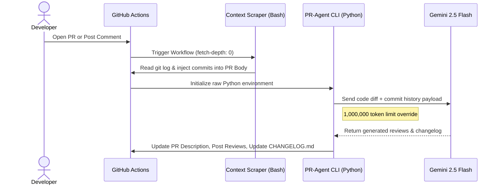

# 🔗 Navigation

- [Home](index.md)
- [Requirements Specification](requirements-specification.md)
- [Concept of Operations](con-ops.md)
- [High Level Design](high-level-design.md)
- [Software Subsystem: Navigation and FSM](subsystem-nav-fsm.md)
- [Software Subsystem: ArUco Marker Detection](subsystem-software-aruco.md)
- [Mechanical Subsystem](subsystem-mechanical.md)
- [Electrical Subsystem](subsystem-electrical.md)
- [Interface Control Document](interface-control-document.md)
- [Software and Firmware Development](software-firmware-development.md)
- [Testing Documentation](testing-documentation.md)
- [User Manual](user-manual.md)
- [Areas for Improvement](improvements.md)
- [Appendix](appendix.md)

---

# Software and Firmware Development

## Build Environment

- ROS2 Humble
- TurtleBot3 workspace at `~/turtlebot3_ws`
- Python 3 tooling for launch and runtime scripts
- Runtime dependencies: `slam_toolbox`, `turtlebot3`, `turtlebot3_gazebo`, `opencv-python`

## Prerequisites

- TurtleBot3 Burger with camera sensor for marker detection and real-robot validation
- A laptop with ROS2 Humble and workspace access
- Raspberry Pi side robot bringup available for hardware runs

## Versioning and Release Notes

- Use semantic versioning for package and docs releases.

## CHANGELOG Reference

- `CHANGELOG.md` is the repository-level version-history reference.
- Keep it as a read-only artifact for documentation purposes.


## CI and Agentic Changelog Pipeline

Pull-request documentation validation is defined in `.github/workflows/docs-build.yml`.
Documentation site deployment is defined in `.github/workflows/docs-pages.yml`.

This repository uses a custom CI pipeline powered by [Qodo PR-Agent](https://github.com/qodo-ai/pr-agent) and Google's **Gemini 2.5 Flash** model to automate pull request management and documentation, standardize our release documentation, enforce Semantic Versioning (SemVer 2.0.0), and reduce administrative overhead. 

Whenever a new Pull Request is opened, the pipeline automatically executes the following suite:
1. **Hardware-Aware Commit Scraping:** Bypasses Git's "binary blindspot" by scraping local git history to document physical CAD changes (`.SLDPRT`, `.STL`, etc.) before the AI runs.
2. **Auto-Describe:** Analyzes the code diff and commit history to automatically write a comprehensive PR Title and Description.
3. **Auto-Review & Improve:** Scans the code for bugs and leaves actionable, inline code suggestions.
4. **Auto-Changelog:** Generates a strict, version-bumped `CHANGELOG.md` block based on your branch's features and fixes.


### Developer Workflow

Developers must follow this workflow when merging code into the `main` branch.

#### 1. Write Conventional Commits
Make sure you are editing on your **LOCAL BRANCH** and not the `main` branch!

The AI agent calculates the next version number strictly based on the prefixes used in your commit messages and PR title. You **must** use one of the following prefixes:

* `feat: ` (New features, architectural additions, nodes. 'MAJOR' is to be included in the commit message for MAJOR versioning, else it defaults to MINOR versioning)
* `fix: ` (Bug fixes, path resolutions, logic errors)
* `docs: ` (Updates to README, comments, or documentation)
* `test: ` (Adding or updating tests/simulations)

for hardware/CAD changes: **BE DESCRIPTIVE** in your commit messages as the CHANGELOG.md will be updated based on your commit messages.

*Example: `feat(navigation): integrate frontier exploration algorithm`*

#### 2. Open a Pull Request

Push your code to your **LOCAL BRANCH** and push that branch to GitHub.
```bash
git push origin [local_branch_name]
```
Open a Pull Request against `main`. 
if you have Github CLI:
```bash
gh pr create --fill
```
(auto-fills latest commit message as title)
* **The Auto-Review & changelog update:** The GitHub Action will immediately wake up, analyze your code diffs, and post a summary of your changes as a comment on the PR. **VERIFY** the documentation on your own and make necessary edits.

**Manual Commands:**
If you need the AI to re-run a specific task, you can type any of these commands as a standard comment in your Pull Request thread:
* `/update_changelog` - Regenerates the changelog.
* `/describe` - Regenerates the PR description.
* `/review` - Re-runs the high-level review.
* `/improve` - Scans for new inline code improvements.
* `/ask [question]` - Ask the AI a specific question about the PR's code.

### AI Pipeline Architecture

This repository utilizes a highly customized, hardware-aware CI/CD pipeline, reads binary CAD diffs (e.g., SolidWorks, STL files) by using a pre-processing commit scraper combined with a native Python implementation of [Qodo PR-Agent](https://github.com/qodo-ai/pr-agent), powered by **Google Gemini 2.5 Flash**.

#### Data Flow Diagram



## Workspace Setup

1. Clone the repository into the ROS workspace:

```bash
cd ~/turtlebot3_ws/src
git clone https://github.com/Kmyming/CDE2310_G10_2526.git CDE2310_G10_2526
cd ~/turtlebot3_ws
```

2. Build `auto_explore` with colcon:

```bash
colcon build --packages-select auto_explore
source install/setup.bash
```

3. Verify package discovery:

```bash
ros2 pkg list | grep auto_explore
```

Expected output:

```text
auto_explore
```

## Package Layout

- `remote_laptop_src/launch/`
- `remote_laptop_src/auto_explore/auto_explore/`
- `remote_laptop_src/config/`

## Build and Run Workflow

- Use `global_bringup.py` for integrated mission startup.
- Use `global_controller_bringup.py` for controller-only bringup.
- Use `nav_bringup.py` for navigation-only bringup.

## Additional Setup (Real Robot)

### Laptop shooter dependency

Install pigpio Python client on the laptop:

```bash
pip3 install pigpio
```

### Raspberry Pi boot-time prerequisites

The Pi should run pigpiod and show its IP at boot.

If needed, run:

```bash
sudo pigpiod
hostname -I
```

### Real-robot shooter launch rule

Copy the Pi IP shown at boot and pass it to `shooter_pigpiod_host`.

Direct command:

```bash
ros2 launch auto_explore global_controller_bringup.py use_sim_time:=false \
	enable_fsm:=true enable_navigation:=true enable_markers:=true \
	enable_pose_publisher:=true enable_docking:=true enable_shooter:=true \
	shooter_enable_hardware:=true shooter_pigpiod_host:=<PI_IP_FROM_BOOT>
```

Reusable shell helper:

```bash
cat >> ~/.bashrc << 'EOF'
start () {
	if [ -z "$1" ]; then
		echo "Usage: start <PI_IP>"
		return 1
	fi

	ros2 launch auto_explore global_controller_bringup.py use_sim_time:=false \
		enable_fsm:=true enable_navigation:=true enable_markers:=true \
		enable_pose_publisher:=true enable_docking:=true enable_shooter:=true \
		shooter_enable_hardware:=true shooter_pigpiod_host:="$1"
}
EOF

source ~/.bashrc
```

### Rebuild after edits

If launch or config changes do not appear:

```bash
cd ~/turtlebot3_ws
source /opt/ros/humble/setup.bash
colcon build --packages-select auto_explore
source install/setup.bash
```

## Launch Sequences (Verified)

### Gazebo simulation

Terminal 1:

```bash
export TURTLEBOT3_MODEL=burger
ros2 launch turtlebot3_gazebo turtlebot3_world.launch.py
```

Terminal 2:

```bash
ros2 launch auto_explore global_bringup.py \
	use_sim_time:=true \
	enable_slam:=true \
	enable_rviz:=false \
	enable_fsm:=true \
	enable_navigation:=true \
	enable_markers:=true \
	enable_pose_publisher:=true \
	enable_docking:=false \
	enable_shooter:=false
```

### Physical TurtleBot3

Terminal 1:

```bash
ros2 launch turtlebot3_bringup robot.launch.py
```

Terminal 2:

```bash
ros2 launch auto_explore global_bringup.py \
	use_sim_time:=false \
	enable_slam:=true \
	enable_rviz:=true \
	enable_fsm:=true \
	enable_navigation:=true \
	enable_markers:=true \
	enable_pose_publisher:=true \
	enable_docking:=true \
	enable_shooter:=true \
	shooter_enable_hardware:=true
```

If shooter host or ultrasonic tuning arguments are required, launch `global_controller_bringup.py` directly, because those arguments are declared at the controller launch layer.

## Launch Arguments by Layer

### Top-level integrated launcher (`global_bringup.py`)

- `use_sim_time`
- `enable_slam`
- `enable_rviz`
- `slam_params_file`
- `enable_fsm`
- `enable_navigation`
- `enable_markers`
- `enable_pose_publisher`
- `enable_docking`
- `enable_shooter`
- `shooter_enable_hardware`

### Controller launcher (`global_controller_bringup.py`)

Includes all controller toggles and shooter tuning arguments:

- `shooter_pigpiod_host`
- `shooter_pigpiod_port`
- `shooter_ultrasonic_trigger_pin`
- `shooter_ultrasonic_echo_pin`
- `shooter_ultrasonic_distance_threshold_m`
- `shooter_ultrasonic_simulated_distance_m`
- `shooter_engage_profile`

### Navigation launcher (`nav_bringup.py`)

- `use_sim_time`
- `enable_slam`
- `enable_rviz`
- `slam_params_file`
- `slam_start_delay_sec`
- `rviz_start_delay_sec`

## RViz Configuration Update

The previous README included a full RViz payload block. This has been moved into this development documentation as process steps:

```bash
cp ~/turtlebot3_ws/src/turtlebot3/turtlebot3_cartographer/rviz/tb3_cartographer.rviz ~/tb3_cartographer.rviz.backup
nano ~/turtlebot3_ws/src/turtlebot3/turtlebot3_cartographer/rviz/tb3_cartographer.rviz
```

Use the team-approved RViz file content for the cartographer view. Verify with:

```bash
rviz2 -d ~/turtlebot3_ws/src/turtlebot3/turtlebot3_cartographer/rviz/tb3_cartographer.rviz
```

## Launch Components

The integrated bringup includes:

- SLAM Toolbox
- RViz visualization
- Mission FSM
- Exploration controller
- ArUco pose publisher


## Configuration Management

- Describe the SLAM and navigation parameter files.
- Record which settings are source-of-truth and where they live.

## Troubleshooting Development Issues

- Overlay/source problems.
- Launch-argument propagation mismatches.
- RViz environment contamination.