---
---

## 🔗 Navigation

- [Home](index.md)
- [Requirements Specification](requirements-specification.md)
- [Concept of Operations](con-ops.md)
- [High Level Design](high-level-design.md)
- [Software Subsystem: Navigation and FSM](subsystem-nav-fsm.md)
- [Software Subsystem: ArUco Marker Detection](subsystem-software-aruco.md)
- [Mechanical Subsystem](subsystem-mechanical.md)
- [Electrical Subsystem](subsystem-electrical.md)
- [Interface Control Document](interface-control-document.md)
- [Software and Firmware Development](software-firmware-development.md)
- [Testing Documentation](testing-documentation.md)
- [User Manual](user-manual.md)
- [Areas for Improvement](improvements.md)
- [Appendix](appendix.md)

---

# Mechanical Subsystem

  
   

## Problem Description

The mechanical subsystem needs to aid in the successful delivery of 3 ping pong balls per delivery receptacle once the turtlebot is docked. There are 2 delivery zones - static & dynamic. The delivery sequence is per a specific timing sequence at the static delivery zone, with no timing sequence at the dynamic delivery zone, but must be able to successfully deliver 3 ping pong balls into a moving delivery receptacle. It must be designed to store and launch ping pong balls reliably from a TurtleBot3 platform without compromising stability, safety, or sensor visibility. The core challenge is integrating a compact launcher and feed mechanism into limited robot space while maintaining consistent launch performance per the requirements of each delivery zone.

Primary mechanical pain points identified during development were:

- high precision of feeder & rack-and-pinion motion required with low geometric tolerance
- friction losses in the launcher channel
- feed consistency into the launch path & launch consistency
- gear slipping during repeated test cycles

## Design Requirements

### Overall requirements:
- Allow practical assembly and maintenance access for wiring and servo hardware.
- Maintain center-of-gravity placement that does not destabilize the TurtleBot3.
- Keep LiDAR and critical sensing lines of sight unobstructed.

### Storage:
- Hold and guide ping pong balls through a repeatable feed and launch sequence.
- The robot must be able to carry and securely store **nine ping pong balls.**
- Balls must not escape during the mission.
- Feeder should only allow one ball to be fed into the launcher in every feed and launch sequence.

### Launcher:
- Must be able to launch the ping pong ball horizontally forward into delivery receptacles **with a docking distance of 10cm from the camera to the ArUco Marker**.
- Must be able to launch at specific timing intervals at the static delivery zone **(LAUNCH - 1s - LAUNCH - 9s - LAUNCH)**.
- Must be able to launch into a moving delivery receptacle at the dynamic delivery zone with **no prior knowledge of receptacle linear velocity**
- Support rapid iteration and replacement of launcher subassemblies.

### Sensor mounts:
- RPi Camera and Ultrasonic sensor needs to be mounted at the correct angles for proper calibration of markers/correct measurement of distance to detect moving delivery receptacles
- Mounts must be rigid and not allow movement of sensors during operation that can affect sensor data reliability

## System Overview & Machine Elements

The mechanical architecture uses a **servo-driven rack-and-pinion launcher in a tilted launcher assembly** to launch the balls into static and dynamic delivery receptacles. The balls are stored in a **helix storage**, and feeding is controlled via a **servo gate**. The launcher interface is mounted to the robot using **detachable hex-mount geometry** for easier iteration and replacement.

### Key machine elements:
#### 1. Rack-and-Pinion Servo-driven launcher
- 3D-printed: 1x launcher main body, 1x rack, 1x pinion sector gear, 1x conical pusher, 1x servo bracket, 2x hex mounts
- fasteners: 2x M2.5x10 self-tapping screws, 1x M2x15 screw, 1x M2 Nut, 2x M2x15 self-tapping screws, M2.5x5 screw + modified single arm servo horn 
- electronics: 1x MG90S Continuous Rotation Servo Motor, 1x HC-SR04 Ultrasonic Sensor
- Tensioned via 1x Spring and 1x Rubber band

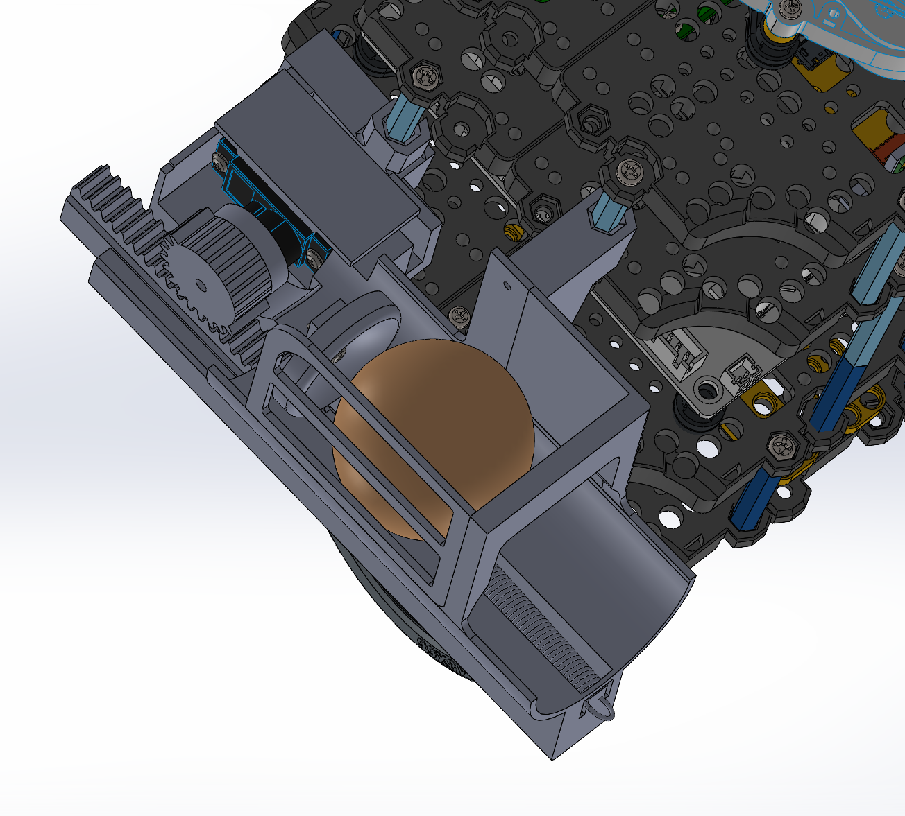

#### 2. Helix storage & Servo gate
- 3D-printed: 1x helix storage, 1x servo horn mount
- fasteners: 2x M2.5x10 self-tapping screws, M2.5x5 screw + single arm servo horn 
- electronics: 1x SG90 Servo Motor

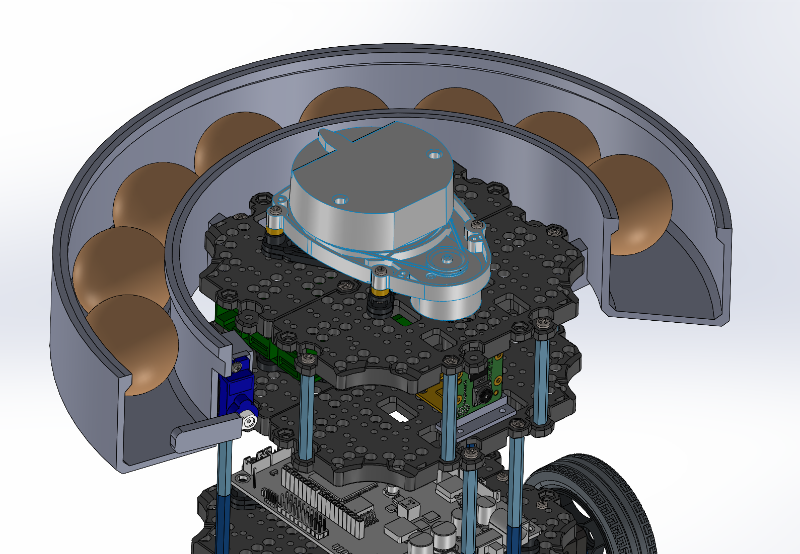

#### 3. RPi Camera:
- 3D-printed: RPi Camera Mount & Stand
- fasteners: 6x M2x15 screws, 6x M2 Nuts
- electronics: RPi Camera V2.1

  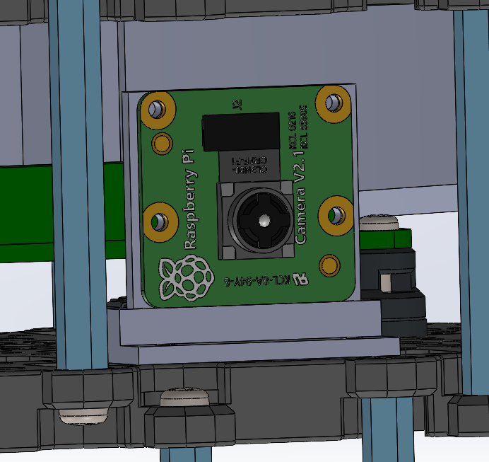

## Other Strategies

During concept exploration, alternative strategies considered included:

### Storage & feeding:

Vertical stack:

Lets gravity pull the balls down into the launching mechanism. However, this will obstruct the Lidar (Fig. 1). This is easily fixed by stacking the balls in a curved tube (Fig. 2) instead of vertically on top of each other.

  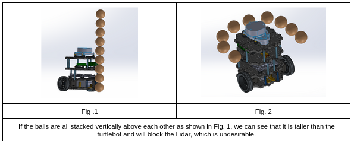

Helix Storage:

The balls can be stored by lining them up one-by-one in a helix structure around the Turtlebot 3, and gravity can pull the balls down to the release zone sequentially. The structure can follow a half-open tube design. A servo gate may be deployed to control the flow of the balls and the number released. 

Ferris Wheel Storage:

Similar to Ferris wheels, the balls can be stored vertically in a circular pattern. The balls will be stored in containers in the wheel. Spinning the wheel will cause one ball to exit the wheel through an opening at the top of the wheel (like a revolver-style release mechanism) into a ramp that slides the ball down to the release zone that can be controlled by a servo gate mechanism. If the wheel is unable to keep all 9 balls, remaining balls can be lined up on the ramp for storage and fed via a servo gate mechanism into the launcher. 

  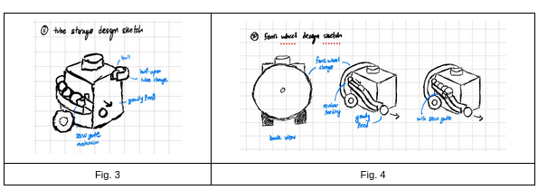

### Launching Mechanism:

Gravity Feed:

This is the lowest energy design utilising no extra motors or actuators. It uses gravity for the ball to gain sufficient kinetic energy to roll into the delivery receptacle. The ball will utilise the half-open tube/ramp to roll down into the delivery receptacle. This design can be paired with both storage & feeding mechanisms. 

Spring-loaded launcher:

This design involves using a spring to push the ball from the release zone into the delivery receptacle. The spring will be initially compressed, using servos as a catch, and when the ball is at the release zone, it is released to launch the ball horizontally into the receptacle. This design can be paired with both storage mechanisms, but will require the servo gate mechanism to set the ball at the release zone unless a coordinated feeding & launching timing sequence is developed. 

  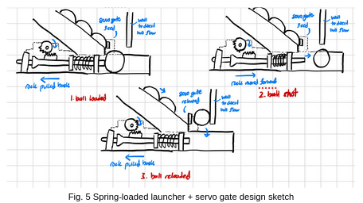

Solenoid Plunger:

This design involves using a solenoid plunger system as a pusher to push the ball horizontally forward. When the ball is at the release zone, the plunger is moved forward, launching the ball horizontally into the receptacle. The plunger will then be reset to let the subsequent ball enter the release point for launching. This design can also be paired with both storage mechanisms, but will require the servo gate mechanism to set the ball at the release zone unless a coordinated feeding & launching timing sequence is developed. 

  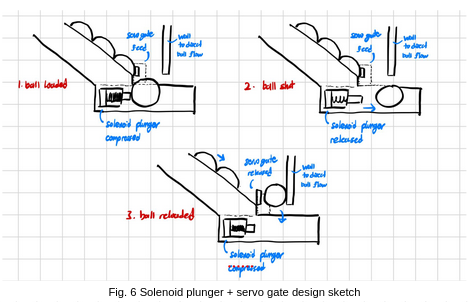

Flywheel Launcher:

The design would include a wheel that is spinning at >2000 rpm, usually achieved by using one big gear to drive a smaller gear. If not found online, our gears will likely be 3D printed. Depending on what gears we use, we would require the driving motor to spin at different speeds. There are two different flywheel designs: single and double. When the ball is at the release zone, a servo-powered linear actuator will be used to push the ball into the flywheels. The flywheels will come into contact with the ball and launch it horizontally into the receptacle. This design can be paired with both storage & feeding mechanisms. 

  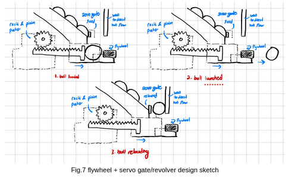

## Evaluation of Design Options

| Subsystem | Option | Advantages | Limitations | Other Notes |
|---|---|---|---|---|
| Storage | Tubed storage & feeding | Easy to implement with no additional moving parts. | Less space efficient as balls surround the entire turtlebot, and a large, half-open helix tube structure is required for storage. | If combined with the gravity feed launching mechanism, balls may not gain enough kinetic energy to be launched into the receptacle.|
| Storage | Ferris Wheel storage & feeding | Space-efficient. Balls are kept compact vertically at the back of the turtlebot, with reduced tube required (only for launching mechanism) | Many moving parts, more complicated to implement. Requires an additional motor to control the rotation, which requires additional power. | If servo is not precise enough, the balls may not be released as the holes do not align, or multiple balls may be released at the same time. May obstruct the launching mechanism, and it will protrude out from the back of the turtlebot.|
| Launch | Gravity feed | Easy to implement, as no additional electrical components are required to launch the balls. | As the ball needs to gain sufficient kinetic energy to be able to be launched into the receptacle successfully, the release height of the ball needs to be high enough. | The height of release for the ping pong ball is calculated to be 14.3 cm for a docking tolerance of 15 cm (see Appendix B). This height is too high for both storage mechanisms to be feasibly implemented without blocking the LiDAR (height of turtlebot without LiDAR is 15.2cm).  |
| Launch | Spring-loaded launcher | Simple structure that is relatively easy to implement. | An additional mechanism is required to lengthen the spring. | Failure of the mechanism due to wear and tear. |
| Launch | Solenoid Plunger | Simple structure that is relatively easy to implement. | Additional weight & power requirements make it more complicated to implement. | |
| Launch | Flywheel launcher| Steady, reliable launching power. | Launching power may be too strong for this mission, and the balls may bounce out of the receptacle. More complicated to implement with more moving parts & additional weight & power requirements. | Might squish the ping pong ball too hard and deform it|

For this project context, the tubed storage with servo gate and the rack-and-pinion spring loaded launcher was selected. Tubed storage will not require additional moving parts & will not obstruct the launcher, unlike the Ferris wheel. The spring-loaded launcher has the least additional weight & power requirements with a structure relatively easy to implement, while remaining feasible.

## Assembly Plan

1. 3D Print and post-process primary parts (launcher body, rack, mounts, covers). Procure remaining machine elements required.
2. Verify dimensional fit for rack-pinion sliding and servo interface before full build.
3. Modify MG90S single arm servo horn, removing the arm. Secure into MG90S Servo using 1x M2.5x5. Fit it into pinion gear and secure using super glue.

  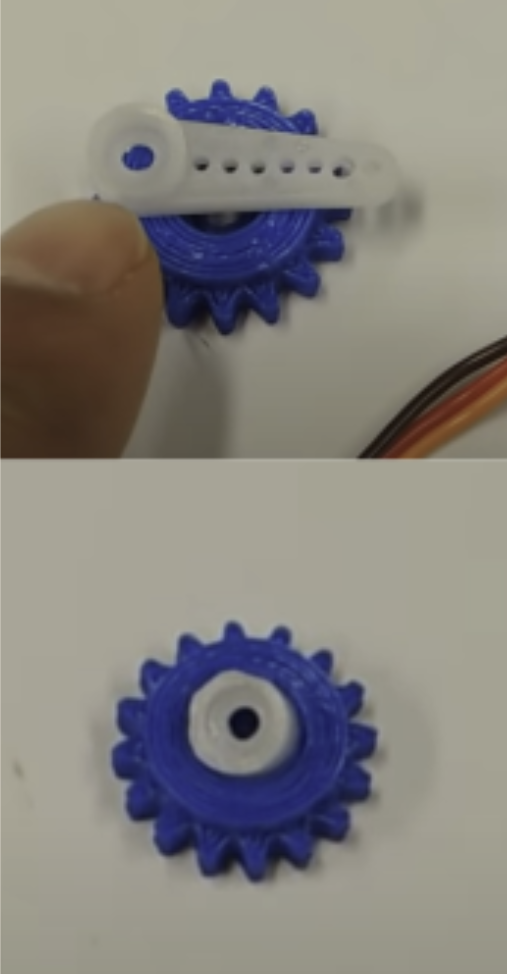

3. Assemble Rack with conical pusher using M2x15 and M2 Nut. 
4. Assemble launcher main body with rack and pusher and 1x spring and 1x rubber band.

  

5. Install MG90S and SG90S into respective mounts and secure using 2x M2.5x10. Attach servo cover over MG90S and secure using 2x rubber bands.

  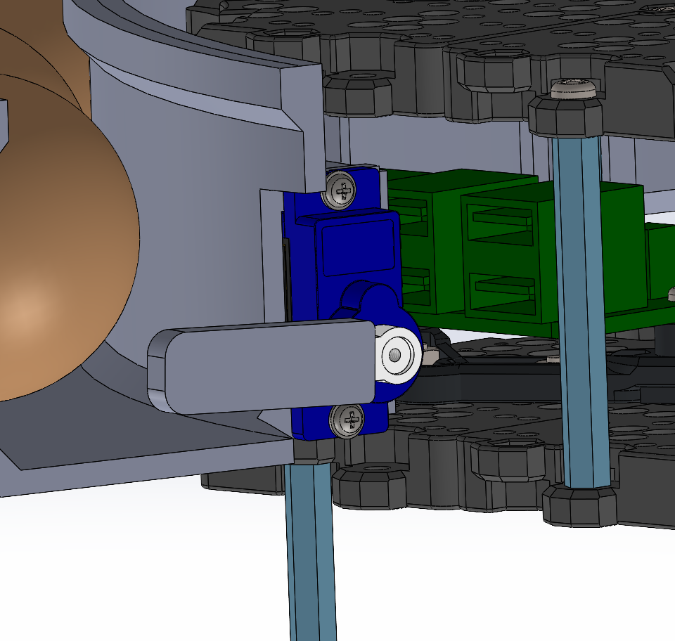
   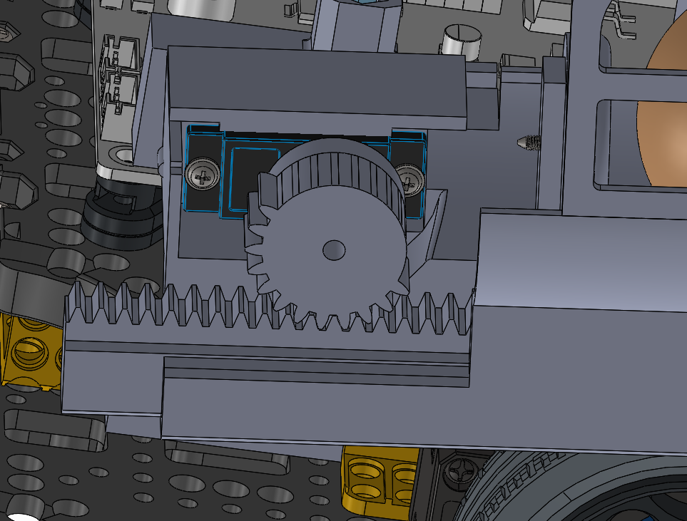

6. Install detachable hex mounts to turtlebot hex standoffs.

  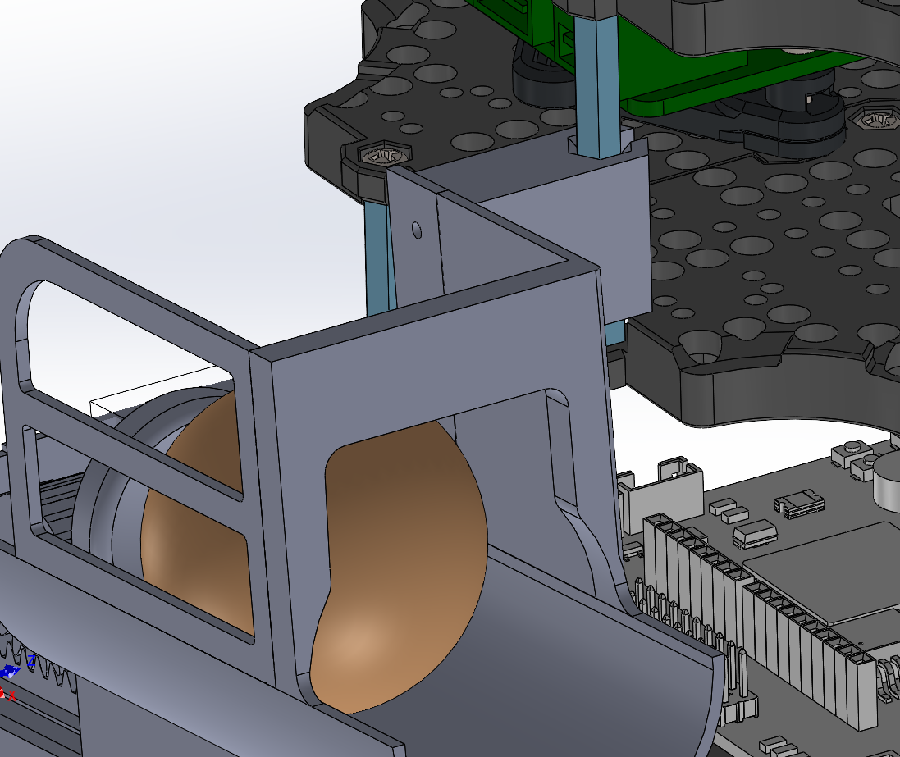
   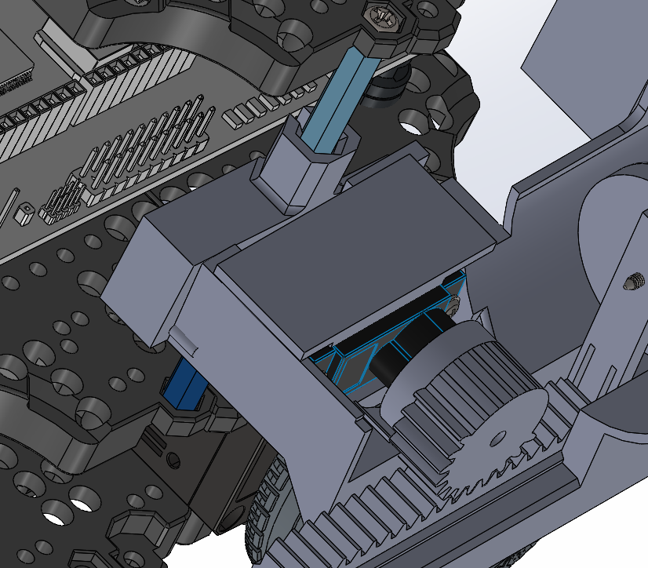

7. Secure launcher main body into hex mounts using 2x M2x15.

  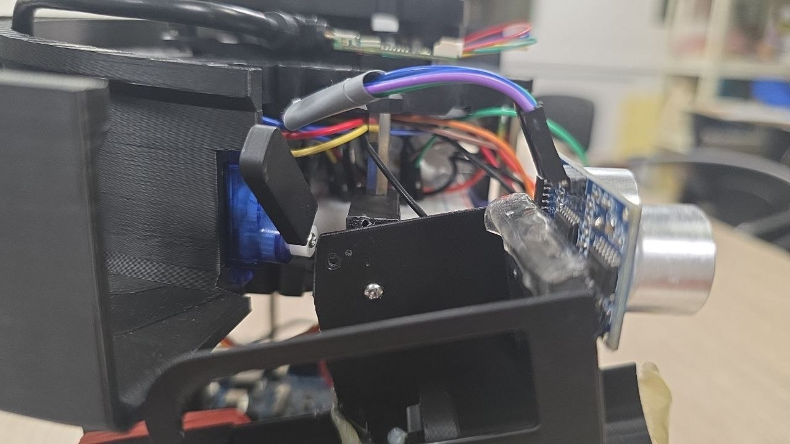
   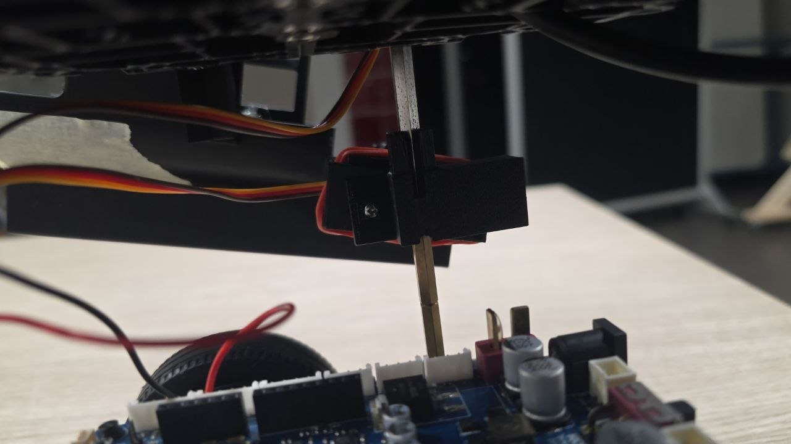

8. Secure helix storage into hex standoffs.

  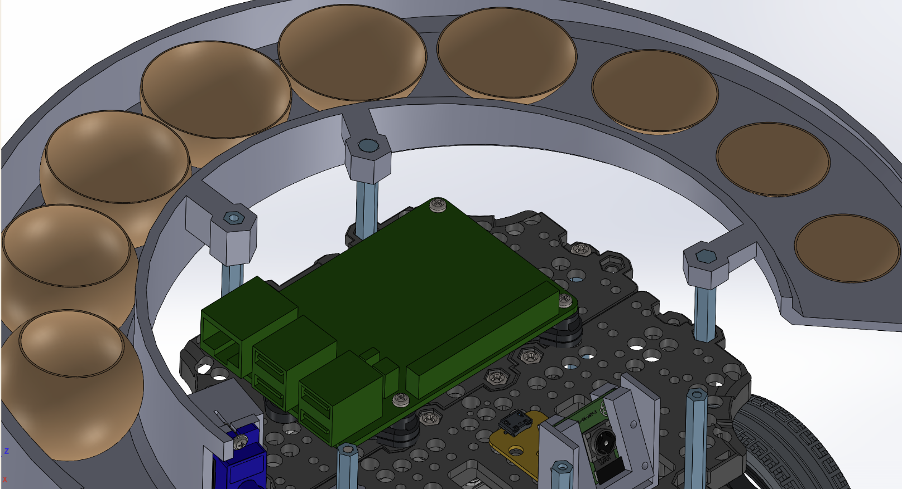
   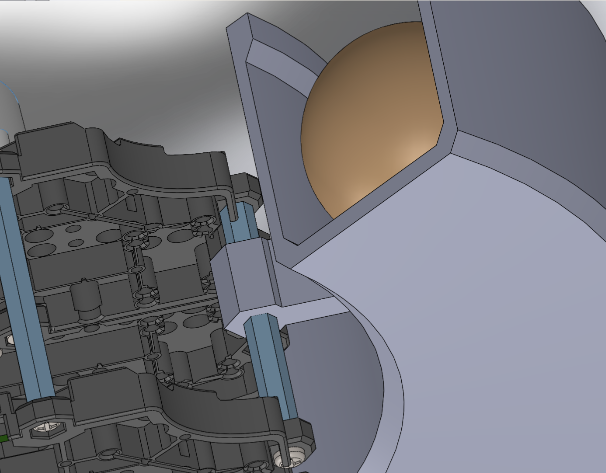

9. Secure RPi Camera and mount into third waffle layer using 6x M2x15 screws, 6x M2 Nuts.

  

10. Attach HC-SR04 Ultrasonic sensor to front of launcher using double sided tape.

  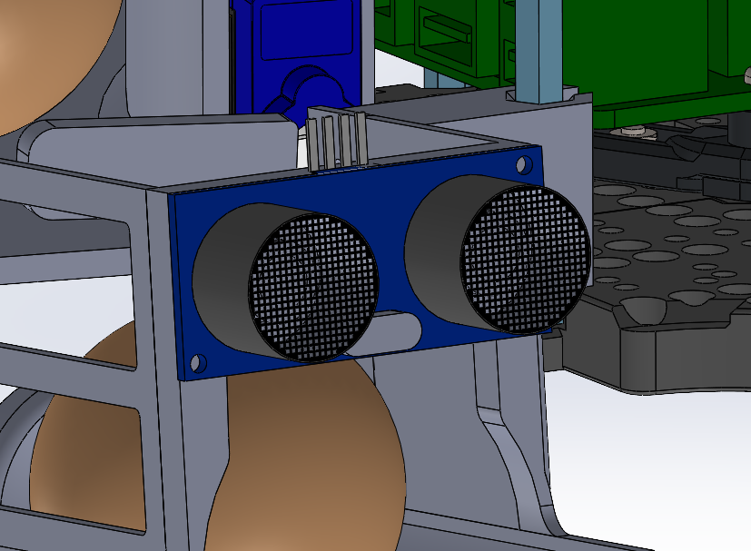

11. Add hot glue along launcher wall (1x row along stop, 1x row in front of stop), 2x masking tape at front of launcher to act as paper gates.

  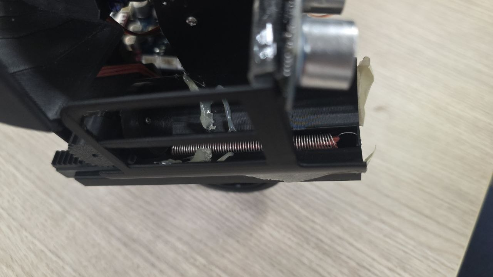

## Build of Materials (BOM)

| Equipment | Qty | Price | Notes |
|---|---|---|---|
| 3D Printed Parts (Helix storage, Launcher, RPi Camera Mount) | - | $50 | Includes rack, pinion, servo mounts, hex mounts, conical pusher |
| MG90S Continuous Rotation Servo | 1 | $4.91 | Launcher rack-and-pinion actuation - [Source](https://shopee.sg/product/203724137/24136009312) |
| Spring | 1 | LAB | Launcher tension element |
| Logic Level Shifter | 1 | LAB | GPIO signal conditioning for servo and sensor |
| Electrical Components (Resistors, connectors) | - | LAB | Signal conditioning and wiring |
| M2x15 Screws | 9 | LAB | Fastening rack (1), launcher hex mounts (2), and camera mount (6) |
| M2 Nuts | 7 | LAB | Fastening with M2x15 screws (1 for rack, 6 for camera) |
| M2.5x10 Self-tapping Screws | 4 | LAB | MG90S and SG90S servo mount attachment (2 each) |
| M2.5x5 Screws | 2 | LAB | Servo horn attachment to MG90S (1) and SG90S (1) |
| Single Arm Servo Horns | 2 | LAB | Modified for MG90S pinion (1), SG90S helix storage gate (1) |
| Rubber Bands | 3 | LAB | Launcher tensioning (1) and servo cover attachment (2) |
| TurtleBot3 Burger Kit | 1 | LAB | Base robot platform |
| HC-SR04 Ultrasonic Sensor | 1 | LAB | Distance detection for receptacle |
| Double-sided Tape | - | LAB | Ultrasonic sensor mounting |
| Hot Glue | - | LAB | Launcher wall reinforcement |
| Masking Tape | - | LAB | Paper gates at launcher exit |
| RPi Camera V2.1 | 1 | GIVEN | ArUco marker detection |
| SG90 Standard Servo | 1 | GIVEN | Helix storage gate control |

## Actuator Mechanics

The launcher mechanism is a **rotary-to-linear transmission** where servo torque is translated through pinion teeth into rack displacement. The system consists of a synchronized servo-driven architecture with two key actors: the **rack servo** (continuous rotation) and the **gate servo** (standard). The system operates in a coordinated multi-step cycle to ensure repeatable, collision-free ball loading and launch.

### Mechanism Overview

- **Rack Servo (MG90S Continuous)**: Controls the horizontal pusher (rack) motion via pinion-to-rack gear mesh. Engagement pulls the rack backward (pressurizing the spring); disengagement releases the rack forward to launch the ball.
- **Gate Servo (SG90 Standard)**: Controls the binary gate mechanism. Opening allows a ball to drop into the launch channel; closing traps the ball in the launcher for the ensuing rack release.

### Full Delivery Cycle (Static & Dynamic)

#### Phase 1: Engage Rack (Pullback & Load)

1. Send continuous servo signal to **pinion servo** (engagement pulse width: ~1000–1300 µs depending on profile).
2. Hold engagement for **engagment duration** (~1s on mild profile) to pull the rack fully backward and compress the spring.
3. Move rack servo to **neutral position** (1500 µs pulse width) to stop motion.
4. Hold neutral for **rack_hold_duration** (~0.2 seconds) to stabilize the rack at maximum compression.
5. **Spring tension** is now stored; ball is ready to be fed into the launcher.

#### Phase 2: Gate Open (Feed Ball)

1. After a configurable offset from engage start (default: 0.35 seconds), send signal to **gate servo** to open position (gate_open_us: 500 µs).
2. Wait **gate_settle_s** (~0.225 seconds) for the gate mechanism to fully open and ball to drop from helix storage into the channel.
3. Ball is now positioned in the launcher channel at the pusher contact point.

**Synchronization note:** The offset between engage start and gate open ensures the spring is under tension before the ball arrives, preventing premature or inconsistent feed behavior.

#### Phase 3: Close Gate (Trap Ball)

1. Send signal to **gate servo** to closed position (gate_close_us: 1000 µs).
2. Wait **gate_settle_s** (~0.225 seconds) for gate to fully close. 
3. Timing is tuned such that only 1 ball is loaded into launcher.

#### Phase 4: Release Rack (Launch)

1. Wait **close_to_release_s** (~0.03125 seconds) to ensure gate closure is stable before launch impulse.
2. Send continuous servo signal to **pinion servo** to release position (1000 µs) to unlock and push the rack forward rapidly.
3. Rack travels forward, driven by spring and rubber band tension, pushing the ball into the launcher tube and out the exit opening.
4. Wait **disengage_pause** (cycle-dependent, e.g., 0.3 seconds base) to allow ball to fully exit and rack to settle.
5. Move rack servo back to **neutral position** (1500 µs) to complete the cycle.
6. **Next cycle can begin:** rack is reset and ready for re-engagement.

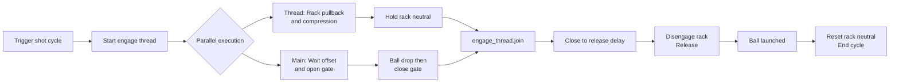
### Timing Dependencies & Profiles

The engagement profile (mild/medium/strong) adjusts the servo pulse width and duration:

| Profile | Engage Pulse (µs) | Engage Duration (s) | Use Case |
|---|---|---|---|
| Mild | 1000 | 1.0 | Light compression, shorter spring hold |
| Medium | 1200 | 1.4 | Balanced launch energy and reliability |
| Strong | 1300 | 1.52 | Maximum compression, maximum launch distance |

Mild profile is used in the final project version.

Additional timing parameters:
- **gate_settle_s** (~0.225 s): Delay after gate movement to allow mechanical settling.
- **ball_drop_s** (~0.225 s): Delay after gate opens to allow ball to fall into launcher channel.
- **close_to_release_s** (~0.03125 s): Delay after gate closes to stabilize before launch.
- **rack_hold_duration_s** (~0.2 s): Delay after rack reaches neutral to ensure stable compression hold.
- **rack_cycle_pause_s** (cycle-dependent): Delay after release to allow rack motion to settle before next cycle.

### Static Delivery (Timing Sequence):
Static delivery follows a fixed timing sequence:
1. First ball launched
2. 1 second wait
3. Second ball launched
4. 9 second wait
5. Third ball launched

### Dynamic Delivery (Two-Pass Mode)

For the dynamic delivery zone with moving receptacles:

**Pass 1 (Load):**
- Activates when target receptacle is first detected via ultrasonic sensor feedback (receptacle distance ≤ 0.70 m).
- Perform phases 1–3 (engage rack, open gate, close gate).
- **Skip phase 4:** Do NOT release the rack yet; ball remains loaded.
- Rack holds compressed state while waiting for receptacle approach.

**Pass 2 (Launch):**
- Perform phase 4 (release rack) when the target receptacle is detected for the second time at a optimal distance.
- Timing is triggered by ultrasonic sensor feedback.
- Ball launches into the moving receptacle with synchronized release.

### Full Delivery Cycle

  <video width="360" height="360" controls>
    <source src="assets/subsystem-mechanical/videos/delivery.MP4" type="video/mp4">
    Your browser does not support the video tag.
  </video>

## Fabrication Plan & Materials

All custom mechanical parts were fabricated using 3D printing to support rapid prototyping and keep production cost low. Printing was carried out on the **Bambu Lab Carbon X1** and **Bambu Lab A1** using **PLA** as the default filament.

| Custom Part Group | Printer | Filament | Infill / Pattern | Purpose |
|---|---|---|---|---|
| Helix storage | Bambu Lab Carbon X1 / A1 | PLA | 10% infill with lightning infill pattern | Used to reduce material usage while maintaining sufficient strength for the storage section |
| Rack and pinion mechanism | Bambu Lab Carbon X1 / A1 | PLA | 40% infill with default infill pattern | Used to improve rigidity and wear resistance, reducing the risk of gear slipping |
| Launcher body | Bambu Lab Carbon X1 / A1 | PLA | 25% infill | Used to reduce launcher flex while keeping the part lightweight for repeated testing |
| Remaining custom parts | Bambu Lab Carbon X1 / A1 | PLA | Default print settings | Used for all remaining parts where additional reinforcement was not necessary |

Fabrication notes:

- All custom parts were printed in PLA using the default 3D printing filament.
- The helix storage uses lower infill because structural loads are comparatively low, allowing material usage to be reduced.
- The rack-and-pinion parts use higher infill to improve stiffness and reduce wear during repeated actuation.
- The launcher uses intermediate infill to limit flex under load without overbuilding the part.
- Default settings were used for the remaining parts to keep fabrication straightforward and consistent.

## Iterative Design Changes

| Issue Observed | Fixes Applied |
|---|---|
| Rack-pinion tolerance too tight and pinion wall interference | Removed the wall in the pinion-rack region to improve clearance |
| Pusher was taller than required | Reduced the pusher profile to prevent unnecessary interference |
| Launcher was difficult to service on the robot | Made the launcher detachable from the hex mounts for easier maintenance and rework |
| Ball drop into the launcher was inconsistent and tolerance was too tight | Moved the wall and stop further up to improve feed consistency |
| Launch distance was insufficient | • Increased gear teeth • Added rubber bands with the spring for additional tensioning • Made the pusher conical shaped for self-alignment of the ping pong ball during launch to prevent energy loss from hitting launcher walls |
| Gear slipping occurred under load | • Added the servo cover to secure the pinion servo tightly • Lowered the servo height to improve gear engagement • Reduced the servo screw hole diameter to lock the servo more firmly • Increased wall thickness to reduce launcher flex under load |
| Ball could fall out laterally | Added a side wall to retain the ball during loading and launch |
| Ball rolling out of launcher before launch | • Made the launcher detachable from the hex mounts to tilt it upwards • Added hot glue stops to prevent launcher jam from excessive ball rollback due to added tilt • Added masking tape gates at the front of the launcher to further prevent ball rollout |

## Final Design & Validation

The final mechanical design adopts a detachable, servo-driven rack-and-pinion launcher with reinforced walls, tuned gear spacing, and improved retention geometry. Compared with early prototypes, the final configuration significantly improves feed reliability, removes slip events, and supports maintainable integration on the TurtleBot3.

  <video width="360" height="480" controls>
    <source src="assets/subsystem-mechanical/videos/finaldesign.mp4" type="video/mp4">
    Your browser does not support the video tag.
  </video>

### Validation summary:
- Passed all Technical Performance Measures and Measures of effectiveness
- **18/18 successful consecutive launches** with **correct static delivery timing sequences**. 
- **No feeding or launcher jam errors**, all ping pong balls entered receptacle at **distance of 13cm from launcher**, significantly above required docking tolerance of 10cm from RPi Camera to ArUco marker