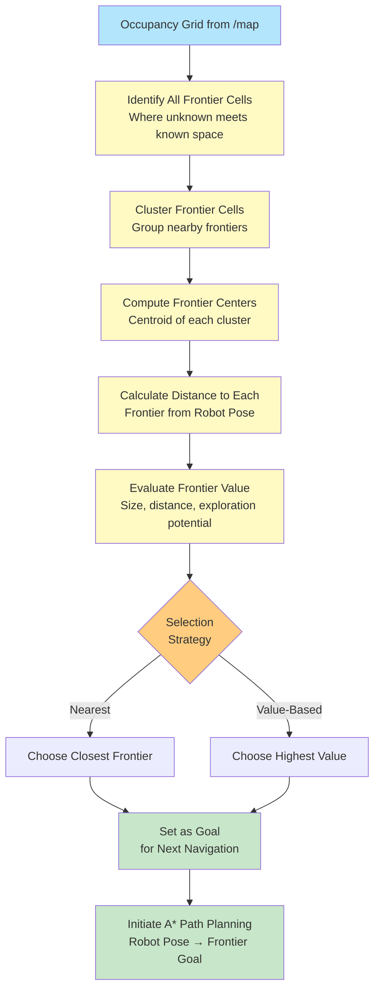
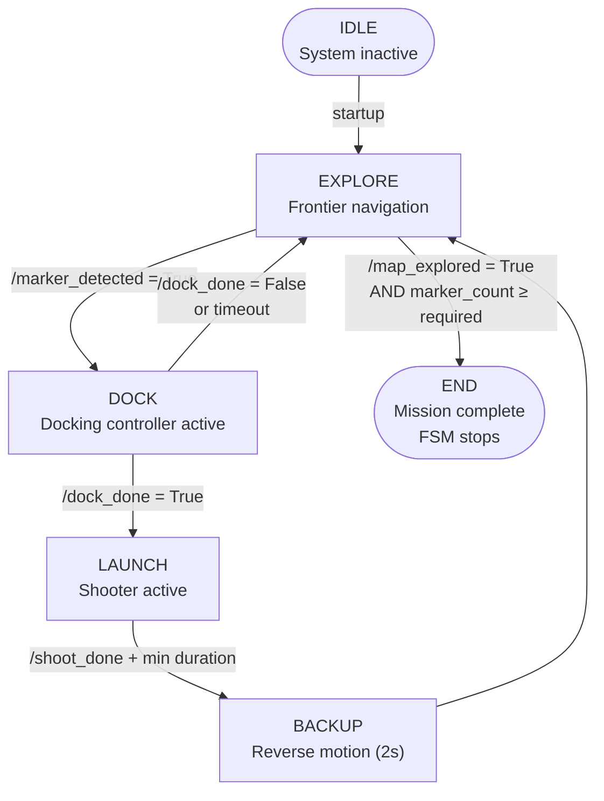

# 🔗 Navigation

- [Home](index.md)
- [Requirements Specification](requirements-specification.md)
- [Concept of Operations](con-ops.md)
- [High Level Design](high-level-design.md)
- [Software Subsystem: Navigation and FSM](subsystem-nav-fsm.md)
- [Software Subsystem: ArUco Marker Detection](subsystem-software-aruco.md)
- [Mechanical Subsystem](subsystem-mechanical.md)
- [Electrical Subsystem](subsystem-electrical.md)
- [Interface Control Document](interface-control-document.md)
- [Software and Firmware Development](software-firmware-development.md)
- [Testing Documentation](testing-documentation.md)
- [User Manual](user-manual.md)
- [Areas for Improvement](improvements.md)
- [Appendix](appendix.md)

---

# Software Subsystem: Navigation and FSM

## Document Purpose

This is the **design specification for the navigation and mission control subsystems**: exploration algorithm, path planning, FSM state flow, and subsystem architecture. This document explains WHAT the subsystems do and WHY.

**Cross-references for integration:**
- [interface-control-document.md](interface-control-document.md) - Complete ROS topic specifications, timing, and error handling
- [software-firmware-development.md](software-firmware-development.md) - Practical build, launch, and troubleshooting guides

## Purpose

Provide autonomous frontier-based exploration, mission-state coordination, and velocity control for the TurtleBot3 mission stack.

## Runtime Entry Point

Navigation is launched from `remote_laptop_src/launch/nav_bringup.py` either directly or through the integrated bringup.

FSM logic is launched from `remote_laptop_src/launch/global_controller_bringup.py` through `mission_controller`.

## Launch Interface

For complete launch argument documentation, see [interface-control-document.md](interface-control-document.md#launch-arguments).

**Navigation launcher (`nav_bringup.py`) key arguments:**
- `enable_slam` - Enable SLAM Toolbox mapping
- `enable_rviz` - Enable RViz visualization  
- `slam_params_file` - Path to SLAM config YAML
- `slam_start_delay_sec` - Delay before SLAM start (prevents startup races)
- `rviz_start_delay_sec` - Delay before RViz start (lets SLAM initialize first)

For practical launch examples and sequencing, see [software-firmware-development.md](software-firmware-development.md#launch-sequences-verified).

## Exploration Algorithm

The exploration controller uses frontier-based path planning to autonomously discover unmapped regions:

1. **Frontier Detection**: Identifies boundaries between known and unknown space in the occupancy grid
2. **Goal Selection**: Selects the nearest frontier or highest-value frontier as the next waypoint
3. **Path Planning**: Computes collision-free path using A* algorithm with configurable expansion and cost parameters
4. **Path Smoothing**: Applies spline interpolation to smooth the planned path for smoother robot motion
5. **Goal Achievement**: Uses lookahead-distance control to track the path and advance to the next frontier
6. **Completion**: Signals `/map_explored` when no frontiers remain in the map

**Configuration Parameters** (from `config/params.yaml`):
- `speed`: Linear velocity command (m/s)
- `lookahead_distance`: Distance ahead on path for steering control (m)
- `expansion_size`: Grid expansion for obstacle clearance (cells)
- `target_error`: Acceptable distance error to goal (m)
- `robot_r`: Robot radius for collision checking (m)

## Path Planning

The exploration controller computes safe, smooth paths from the current robot pose to frontier goals:

1. **Map Representation**: Consumes occupancy grid from SLAM Toolbox (`/map`)
2. **A* Search**: Finds optimal path while respecting obstacles and robot radius
3. **Collision Avoidance**: Maintains clearance around obstacles using expansion parameter
4. **Spline Smoothing**: Applies scipy B-spline interpolation to create smooth, differentiable paths
5. **Execution**: Publishes path to `/exploration_path` for visualization in RViz
6. **Control**: Uses lookahead distance and path curvature to compute steering and speed commands

**Data Flow:**
- Input: `/map` (OccupancyGrid), `/odom` (current pose), `/scan` (immediate obstacles)
- Output: `/cmd_vel_nav` (Twist commands to FSM), `/exploration_path` (Path visualization)

### Navigation System Flowchart

The complete navigation workflow operates as follows:

```mermaid
graph TD
    A["Navigation System Start<br/>10 Hz Control Loop"] --> B{SLAM Map Available?}
    
    B -->|No| C["Wait for SLAM<br/>Toolbox Initialization"]
    C --> C1["Publish Zero Velocity<br/>Prevent Uncontrolled Motion"]
    C1 --> A
    
    B -->|Yes| D["Read Current Robot Pose<br/>from /odom Topic"]
    D --> E["Read Occupancy Grid<br/>from /map Topic"]
    E --> F["Detect Frontiers<br/>Boundary Between Known/Unknown Space"]
    
    F --> G{Any Frontiers<br/>Detected?}
    
    G -->|No Frontiers| H["Publish /map_explored = true<br/>Signal Exploration Complete"]
    H --> I["Publish /cmd_vel_nav: Zero Velocity<br/>FSM Transitions to END State"]
    I --> J["End Navigation Loop"]
    
    G -->|Frontiers Found| K["Select Best Frontier Goal<br/>Nearest or Highest Priority"]
    K --> L["Run A* Path Planning Algorithm<br/>Current Pose → Frontier Goal"]
    
    L --> M{Valid Path<br/>Found?}
    
    M -->|No Route Exists| N["Publish Zero Velocity<br/>Wait for Map Update"]
    N --> N1["Retry Planning Next Cycle"]
    N1 --> A
    
    M -->|Path Exists| O["Extract Waypoint Sequence<br/>from A* Path"]
    O --> P["Apply Spline Smoothing<br/>scipy B-spline Interpolation"]
    P --> Q["Verify Smoothed Path<br/>Collision-Free Check"]
    
    Q --> R{Collision<br/>Detected?}
    
    R -->|Unsafe| S["Fallback to Original<br/>Waypoint Path"]
    S --> T["Publish /exploration_path<br/>RViz Visualization"]
    
    R -->|Safe| T
    
    T --> U["Compute Steering Control<br/>Lookahead Distance Method"]
    U --> V["Calculate Angular Velocity<br/>from Path Curvature"]
    V --> W["Read Speed Parameter<br/>from config/params.yaml"]
    W --> X["Compute Linear Velocity<br/>Limited by Speed Parameter"]
    X --> Y["Create Twist Command<br/>linear.x, angular.z"]
    
    Y --> Z["Publish /cmd_vel_nav<br/>Send to FSM Multiplexer"]
    
    Z --> AA{Robot at<br/>Goal?<br/>Distance < target_error}
    
    AA -->|Yes| AB["Frontier Reached<br/>Advance to Next Frontier"]
    AB --> A
    
    AA -->|No| AC["Continue Following Path<br/>Next Control Cycle"]
    AC --> A
    
    style A fill:#e3f2fd
    style B fill:#fff3e0
    style G fill:#fff3e0
    style M fill:#fff3e0
    style R fill:#fff3e0
    style AA fill:#fff3e0
    style H fill:#c8e6c9
    style I fill:#c8e6c9
    style J fill:#f3e5f5
    style N fill:#ffccbc
    style T fill:#ffe0b2
    style Z fill:#ffe0b2


## Control Loop

The exploration controller runs a responsive real-time control loop:

- **Loop Rate**: 10 Hz timer driving state machine and velocity computation
- **Input Aggregation**: Subscribes to `/map`, `/odom`, `/scan` with adaptive QoS for sensor data
- **Output Frequency**: Publishes `/cmd_vel_nav` at control loop rate (~100 ms cycle)
- **Failsafe**: If map unavailable, controller waits for SLAM before planning

For detailed timing specifications including startup delays and topic publishing frequencies, see [interface-control-document.md](interface-control-document.md#timing-and-rates).

### Sensor Input Integration

```mermaid
graph LR
    subgraph "Sensor Input"
        LIDAR["/scan<br/>LaserScan"]
        ODOM["/odom<br/>Odometry<br/>Robot Pose & Velocity"]
        MAP["/map<br/>OccupancyGrid<br/>from SLAM"]
    end
    
    subgraph "Navigation Processing"
        FRONTIER["Frontier<br/>Detection"]
        ASTAR["A* Path<br/>Planning"]
        SMOOTH["Spline<br/>Smoothing"]
        STEER["Steering<br/>Control"]
    end
    
    subgraph "Output Commands"
        CMDVEL["/cmd_vel_nav<br/>Twist"]
        PATH["/exploration_path<br/>Path Visualization"]
        EXPLORED["/map_explored<br/>Bool Status"]
    end
    
    MAP --> FRONTIER
    MAP --> ASTAR
    ODOM --> ASTAR
    ODOM --> STEER
    LIDAR --> STEER
    
    FRONTIER --> ASTAR
    ASTAR --> SMOOTH
    SMOOTH --> STEER
    
    STEER --> CMDVEL
    ASTAR --> PATH
    FRONTIER --> EXPLORED
    
    style LIDAR fill:#90caf9
    style ODOM fill:#90caf9
    style MAP fill:#90caf9
    style FRONTIER fill:#fff9c4
    style ASTAR fill:#fff9c4
    style SMOOTH fill:#fff9c4
    style STEER fill:#fff9c4
    style CMDVEL fill:#81c784
    style PATH fill:#81c784
    style EXPLORED fill:#81c784
```

### Frontier Detection to Goal Selection



## Parameters and Tuning

Navigation behavior is controlled by parameters in `config/params.yaml`. For detailed parameter management, file locations, and override procedures, see [software-firmware-development.md](software-firmware-development.md#configuration-management).

**Exploration Controller Parameters:**

| Parameter | Type | Default | Description |
|---|---|---|---|
| `speed` | float | 0.09 | Target linear velocity (m/s) |
| `lookahead_distance` | float | 0.24 | Steering lookahead distance (m) |
| `expansion_size` | int | 3 | Obstacle clearance grid cells |
| `target_error` | float | 0.15 | Goal distance tolerance (m) |
| `robot_r` | float | 0.2 | Robot collision radius (m) |

**Quick Tuning Guidelines:**
- Increase `speed` for faster exploration; decrease for tighter spaces
- Increase `lookahead_distance` for smoother paths; decrease for reactive behavior
- Increase `expansion_size` for more conservative obstacle avoidance
- Decrease `target_error` for precise goal reaching; increase for speed

## Launch Sequence

For detailed, step-by-step launch instructions with full commands and rationale, see [software-firmware-development.md](software-firmware-development.md#launch-sequences-verified).

**Quick Reference:**

**Gazebo Simulation (Navigation Only):**
```bash
# Terminal 1: Start Gazebo
export TURTLEBOT3_MODEL=burger
ros2 launch turtlebot3_gazebo turtlebot3_world.launch.py

# Terminal 2: Start navigation (wait 5s for Gazebo to stabilize)
sleep 5
ros2 launch auto_explore nav_bringup.py use_sim_time:=true \
    slam_start_delay_sec:=2.0 rviz_start_delay_sec:=2.0
```

**Physical Robot (Navigation Only):**
```bash
# Terminal 1: Start robot base
ros2 launch turtlebot3_bringup robot.launch.py

# Terminal 2: Start navigation (wait 10s for hardware initialization)
sleep 10
ros2 launch auto_explore nav_bringup.py use_sim_time:=false
```

**Verification Steps:**
1. Source the workspace: `source ~/turtlebot3_ws/install/setup.bash`
2. Confirm `/map`, `/odom`, and `/scan` topics are available: `ros2 topic list`
3. Verify exploration path in RViz by enabling `/exploration_path` visualization

## Failure Handling

For comprehensive error scenarios, fallback behaviors, and recovery procedures, see [interface-control-document.md](interface-control-document.md#error-and-fallback-behavior) and [software-firmware-development.md](software-firmware-development.md#troubleshooting-development-issues).

**Common Navigation Failures:**

**Map unavailable (SLAM not running):**
- Exploration controller publishes zero velocity
- FSM remains in EXPLORE; no frontiers can be identified
- Recovery: Start SLAM Toolbox; confirm `/map` topic appears within 15 seconds

**Path blocked (no route to frontier):**
- A* algorithm returns empty path
- Controller publishes zero velocity and waits
- Recovery: SLAM updates map; controller retries next cycle (typically within 1-2 minutes)

**LiDAR or odometry offline:**
- Controller detects missing `/scan` or `/odom` data
- Publishes safe zero velocity; navigation halts
- Recovery: Restart sensor nodes; verify `/scan` and `/odom` topics are active

**Marker detection fails:**
- FSM remains in EXPLORE indefinitely
- `/marker_detected` stays `false`
- Recovery: Check camera, verify lighting, test with `ros2 run cv_bridge cv_bridge_demo_color`

**Docking or shooter unavailable:**
- Set `enable_docking:=false` and/or `enable_shooter:=false` at launch
- FSM skips DOCK and LAUNCH states automatically
- Recovery: Enable hardware controllers or accept exploration-only mission

## FSM Section

### Purpose

The finite state machine coordinates mission progression and subsystem handoff (explore, dock, launch, and completion). The FSM also acts as a velocity multiplexer, selecting between navigation (`/cmd_vel_nav`) and docking (`/cmd_vel_docking`) commands based on the active state.

### State Flow and Transitions

```
IDLE → EXPLORE → DOCK → LAUNCH → BACKUP → EXPLORE → ... → END
```
### FSM State Diagram


**State Descriptions:**

- **EXPLORE**: Frontier-based exploration active. Exploration controller seeks unmapped regions. Transitions to DOCK when marker is detected.
- **DOCK**: Docking sequence in progress. Robot approaches and docks with stationary charging/marker station. Publishes docking velocity commands. Transitions to LAUNCH when docking completes (`/dock_done` signal received).
- **LAUNCH**: Shooter engagement in progress. Shooter fires projectile at target. Transition time is minimum 15 seconds (`launch_min_duration_sec`). Transitions back to EXPLORE when shooter completes (`/shoot_done` signal received or timer expires).
- **END**: Mission complete. FSM stops all motion and terminates execution by cancelling the control loop. No further state transitions occur.
- **BACKUP**: Robot reverses for a fixed duration (2 seconds) after payload delivery to safely disengage from the docking area before resuming exploration.

**Transition Triggers:**
- EXPLORE → DOCK: `/marker_detected` Boolean signal = `true`
- DOCK → LAUNCH: `/dock_done` Boolean signal = `true`
- LAUNCH → BACKUP: `/shoot_done = True` AND minimum launch duration elapsed
- BACKUP → EXPLORE: Backup timer completed
- EXPLORE → END: `/map_explored = True` AND `marker_count ≥ required_markers`

### Core FSM Interfaces

For complete ROS topic and message type specifications, see [interface-control-document.md](interface-control-document.md#ros-topics).

**Mission Controller Pub/Sub:**

| Direction | Topic | Type | Purpose |
|---|---|---|---|
| Publishes | `/states` | String | Current state name (EXPLORE, DOCK, LAUNCH, END) |
| Publishes | `/shoot_type` | String | Shooter trigger mode (static, dynamic, or idle) |
| Publishes | `/cmd_vel` | Twist | Arbitrated velocity command (prioritizes docking over exploration) |
| Subscribes | `/marker_detected` | Bool | Marker visibility from pose_publisher |
| Subscribes | `/dock_done` | Bool | Dock completion from docking_controller |
| Subscribes | `/shoot_done` | Bool | Shooter completion from shooter_controller |
| Subscribes | `/map_explored` | Bool | Exploration completion from exploration_controller |
| Subscribes | `/cmd_vel_nav` | Twist | Velocity from exploration_controller |
| Subscribes | `/cmd_vel_docking` | Twist | Velocity from docking_controller |

### Launch Controls

- `enable_fsm` gates mission-controller startup (default: `true`)
- `enable_navigation` gates exploration_controller startup (default: `true`)
- `enable_markers` gates marker detection pipeline (controls pose_publisher)
- `enable_pose_publisher` gates ArUco marker pose publisher (default: `true` when markers enabled)
- `enable_docking` gates docking_controller startup and DOCK state transitions (default: `true`)
- `enable_shooter` gates shooter_controller startup and LAUNCH state transitions (default: `true`)
- `shooter_enable_hardware` enables physical GPIO actuation; set `false` for simulation (default: `false`)

### FSM Verification Checks

Verify FSM state transitions and topic flow:

```bash
# Monitor mission state
ros2 topic echo /states

# Monitor shooter trigger
ros2 topic echo /shoot_type

# Monitor exploration completion
ros2 topic echo /map_explored

# Monitor marker detection
ros2 topic echo /marker_detected

# Monitor docking status
ros2 topic echo /dock_done

# Monitor shooter status
ros2 topic echo /shoot_done
```

**Expected behavior:**
- Initial state publishes `EXPLORE`
- Marker detection transitions to `DOCK` (mission_controller publishes marker trigger zone)
- Docking completion transitions to `LAUNCH` (shooter mode published as `static` or `dynamic`)
- Shooter completion transitions back to `EXPLORE`
- No spurious state loops or rapid re-triggering
