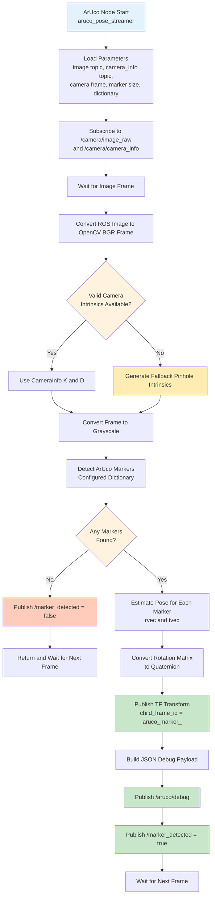

## 🔗 Navigation

- [Home](index.md)
- [Requirements Specification](requirements-specification.md)
- [Concept of Operations](con-ops.md)
- [High Level Design](high-level-design.md)
- [Software Subsystem: Navigation and FSM](subsystem-nav-fsm.md)
- [Software Subsystem: ArUco Marker Detection](subsystem-software-aruco.md)
- [Mechanical Subsystem](subsystem-mechanical.md)
- [Electrical Subsystem](subsystem-electrical.md)
- [Interface Control Document](interface-control-document.md)
- [Software and Firmware Development](software-firmware-development.md)
- [Testing Documentation](testing-documentation.md)
- [User Manual](user-manual.md)
- [Areas for Improvement](improvements.md)
- [Appendix](appendix.md)

---

# Software Subsystem: ArUco Marker Detection

## Document Purpose

This is the **design specification for the ArUco marker detection and pose-publication subsystem**. It explains how the camera stream is processed, how marker poses are estimated, how transforms are published into TF, and how marker visibility is exposed to the mission controller.

**Cross-references for integration:**
- [interface-control-document.md](interface-control-document.md) - Complete topic specifications, parameter interfaces, and TF integration requirements
- [software-firmware-development.md](software-firmware-development.md) - Practical bringup, camera setup, and troubleshooting procedures
- [subsystem-nav-fsm.md](subsystem-nav-fsm.md) - How marker visibility is consumed by the mission controller and docking flow

## Purpose

Provide camera-based ArUco marker detection, pose estimation, TF publication, and lightweight status signaling for downstream mission logic.

This subsystem serves three main functions:

1. **Marker Visibility Detection** - Determines whether one or more configured ArUco markers are currently visible in the camera stream.
2. **Pose Estimation** - Estimates marker translation and rotation relative to the camera using camera intrinsics and marker size.
3. **System Integration Output** - Publishes TF transforms, debug payloads, and a Boolean marker-detected signal for mission-state transitions.

## Runtime Entry Point

The node runs as `aruco_pose_streamer`.

It is intended to be launched through the integrated bringup in `remote_laptop_src/launch/global_controller_bringup.py` when marker processing is enabled.

## Launch Interface

For complete launch-argument definitions and subsystem wiring, see [interface-control-document.md](interface-control-document.md#launch-arguments).

**Marker-processing controls:**
- `enable_markers` - Enables the marker-processing pipeline
- `enable_pose_publisher` - Enables the ArUco pose publisher node

**Node parameters:**
- `image_topic` - Camera image topic to subscribe to
- `camera_info_topic` - Camera calibration topic to subscribe to
- `camera_frame` - Fallback frame name used if incoming image messages do not provide a frame
- `marker_size_m` - Physical side length of the marker in metres
- `dictionary` - OpenCV ArUco dictionary name used for detection

## Detection Pipeline

The ArUco subsystem operates on each incoming image as follows:

1. **Camera Frame Acquisition** - Subscribe to the configured image topic and convert ROS `Image` messages into OpenCV BGR frames using `cv_bridge`.
2. **Calibration Acquisition** - Subscribe to `CameraInfo` and extract the intrinsic matrix `K` and distortion vector `D`.
3. **Fallback Intrinsics Handling** - If valid camera intrinsics are not available, generate a temporary pinhole approximation from image dimensions so that pose estimation can still run.
4. **Marker Detection** - Convert the image to grayscale and detect markers using the configured OpenCV ArUco dictionary and detector parameters.
5. **Pose Estimation** - For every detected marker, estimate `rvec` and `tvec` using `cv2.aruco.estimatePoseSingleMarkers`.
6. **Transform Generation** - Convert the marker rotation matrix to quaternion form and publish a `TransformStamped` into TF.
7. **Mission Signaling** - Publish `/marker_detected = true` when one or more markers are visible and `/marker_detected = false` when none are visible.
8. **Debug Publication** - Publish structured JSON debug output describing node heartbeat and current marker observations.

## Camera and Calibration Inputs

**Primary inputs:**
- `/camera/image_raw`
- `/camera/camera_info`

These defaults can be overridden by parameters.

### Camera Input Handling

The node converts incoming `sensor_msgs/Image` frames into OpenCV images using `CvBridge`. The processing path assumes a standard colour image and requests `bgr8` encoding for downstream grayscale conversion and marker detection.

### Camera Calibration Handling

The node reads the camera matrix and distortion coefficients from `sensor_msgs/CameraInfo`:

- `K` is extracted from the message `k` field and reshaped into a `3 x 3` intrinsic matrix
- `D` is extracted from the `d` field
- If `D` is empty, the node substitutes a zero-distortion vector
- If `fx` or `fy` is zero, the message is treated as invalid and the node falls back to a synthetic pinhole model

### Fallback Intrinsics Strategy

If valid calibration is unavailable, the node constructs a temporary intrinsic matrix using the current frame dimensions:

- `fx = fy = 0.9 * image_width`
- `cx = image_width / 2`
- `cy = image_height / 2`

This allows marker pose estimation to continue in degraded mode. It is suitable for basic functionality and integration testing, but it is less accurate than proper camera calibration and should not be treated as final measurement-grade output.

## Dictionary and Marker Configuration

The detector supports the following predefined dictionaries:

- `DICT_4X4_50`
- `DICT_4X4_100`
- `DICT_4X4_250`
- `DICT_4X4_1000`
- `DICT_5X5_50`
- `DICT_5X5_100`
- `DICT_6X6_50`
- `DICT_6X6_100`
- `DICT_6X6_250`
- `DICT_6X6_1000`
- `DICT_APRILTAG_36h11`

If an unsupported dictionary name is supplied, the node logs a warning and falls back to `DICT_4X4_250`.

The physical marker size is defined by `marker_size_m`. This value directly affects pose estimation scale, so it must match the printed marker size used in the physical system.

## Pose Estimation and TF Publication

For each detected marker:

1. OpenCV returns `rvec` and `tvec` from the single-marker pose estimator.
2. `rvec` is converted to a rotation matrix using `cv2.Rodrigues`.
3. The rotation matrix is converted into quaternion form.
4. A TF transform is published with:
   - `header.frame_id = image frame_id if present, otherwise camera_frame`
   - `child_frame_id = aruco_marker_<marker_id>`

### Pose Output Semantics

The published translation values follow the standard OpenCV ArUco pose convention relative to the camera frame:

- `x` - lateral displacement in the camera frame
- `y` - vertical displacement in the camera frame
- `z` - forward depth from the camera to the marker

The rotation is published as a quaternion derived from the estimated marker orientation.

### TF Naming Convention

Each marker is broadcast into TF using:

```text
aruco_marker_<id>
```

Examples:
- `aruco_marker_0`
- `aruco_marker_1`
- `aruco_marker_21`

This allows downstream TF consumers such as docking logic, visualisation tools, or mission-state logic to refer to marker frames by ID.

### ArUco Processing Flowchart



## Core Interfaces

For complete interface details, timing expectations, and subsystem ownership, see [interface-control-document.md](interface-control-document.md#ros-topics).

### Topic Interfaces

| Direction | Topic | Type | Purpose |
|---|---|---|---|
| Subscribes | `/camera/image_raw` | `sensor_msgs/Image` | Input camera frames for marker detection |
| Subscribes | `/camera/camera_info` | `sensor_msgs/CameraInfo` | Camera intrinsic and distortion parameters |
| Publishes | `/aruco/debug` | `std_msgs/String` | JSON-formatted heartbeat and marker observation data |
| Publishes | `/marker_detected` | `std_msgs/Bool` | Marker visibility signal for mission logic |
| Publishes | `/tf` | `tf2_msgs/TFMessage` via broadcaster | Marker pose transforms in the TF tree |

### Parameter Interfaces

| Parameter | Type | Default | Description |
|---|---|---|---|
| `image_topic` | string | `/camera/image_raw` | Image source for detection |
| `camera_info_topic` | string | `/camera/camera_info` | Camera calibration topic |
| `camera_frame` | string | `camera_optical_frame` | Fallback parent frame for TF |
| `marker_size_m` | float | `0.049` | Physical marker size in metres |
| `dictionary` | string | `DICT_4X4_250` | OpenCV dictionary used for detection |

## Debug and Logging Behavior

The subsystem publishes two forms of runtime observability:

### 1. Heartbeat Messages

A 1 Hz timer publishes a JSON heartbeat to `/aruco/debug`:

```json
{"status": "running", "node": "aruco_pose_streamer"}
```

This provides a lightweight check that the node is alive even when no markers are visible.

### 2. Marker Observation Messages

When markers are detected, the node publishes a JSON object to `/aruco/debug` containing:

- `frame_id`
- list of detected markers
- per-marker `id`
- translation vector `tvec_m`
- rotation vector `rvec_rad`

This output is intended for debugging, inspection, and validation during integration.

## Visibility Signaling Logic

The node publishes `/marker_detected` only when visibility changes.

This edge-triggered behaviour prevents redundant repeated publication of the same Boolean value on every image frame.

**Behaviour summary:**
- first visible frame after invisibility -> publish `true`
- first invisible frame after visibility -> publish `false`
- repeated visible frames -> no duplicate Boolean publication
- repeated invisible frames -> no duplicate Boolean publication

This design reduces unnecessary traffic and provides a clean transition signal to the finite state machine.

### Mission-Logic Integration

The FSM consumes `/marker_detected` during `EXPLORE` and uses it as a trigger to begin docking logic. Marker identity itself is not carried on `/marker_detected`; zone or marker-specific logic must be inferred from TF child frame names or by downstream consumers reading TF directly.

## Control Timing and Execution Model

The node is primarily event-driven:

- `image_cb` executes whenever a new image arrives
- `camera_info_cb` executes whenever camera calibration data arrives
- `heartbeat` executes every 1.0 second

There is no separate planning loop or motion-control timer inside this subsystem. Processing rate is therefore determined mainly by incoming camera frame rate and available compute performance.

### Common Failure Modes

**Missing image stream:**
- No marker detection occurs
- `/marker_detected` will remain unchanged after startup unless visibility transitions have already occurred
- `/aruco/debug` heartbeat still indicates the node is running

**Invalid or missing camera intrinsics:**
- Node warns that `/camera_info` is invalid
- Fallback intrinsics are generated from frame dimensions
- Pose estimates remain available but with reduced accuracy

**Image conversion failure (`cv_bridge`):**
- Node logs an error
- `/marker_detected` is forced to `false`
- Current frame processing is skipped

**No markers in view:**
- Node publishes `/marker_detected = false` on the visibility transition
- No marker TF transforms are published for that frame

**Pose estimation failure:**
- Node logs an error
- `/marker_detected` is forced to `false`
- No transform is published for the failed frame

**Unsupported dictionary name:**
- Node logs a warning
- Detection continues using `DICT_4X4_250`

## Verification Checks

Verify the subsystem with the following commands:

```bash
# Confirm the node is running
ros2 node list | grep aruco_pose_streamer

# Inspect debug heartbeat and marker output
ros2 topic echo /aruco/debug

# Monitor marker visibility transitions
ros2 topic echo /marker_detected

# Inspect published TF frames
ros2 topic echo /tf

# Check the active camera stream
ros2 topic list | grep camera
```

### Expected Behaviour

- The node starts and logs the configured image topic, camera-info topic, marker size, and dictionary.
- `/aruco/debug` publishes periodic heartbeat messages even with no markers visible.
- When a marker enters view, `/marker_detected` transitions to `true`.
- A TF transform appears with child frame name `aruco_marker_<id>`.
- When all markers leave view, `/marker_detected` transitions to `false`.

## Design Rationale

This subsystem keeps detection responsibilities narrow and explicit:

- **Computer vision stays local** - The node handles only image-to-pose conversion and visibility signaling.
- **Pose is exported through TF** - Downstream subsystems can consume marker pose using standard ROS TF tools instead of custom message types.
- **Mission signaling is lightweight** - A simple Boolean topic allows rapid state transitions without requiring all consumers to parse debug payloads.
- **Calibration degradation is graceful** - The node continues operating with fallback intrinsics when calibration is missing, improving bringup robustness.

## Areas for Improvement

Potential future improvements include:

- add timestamped confidence or quality metrics to debug output
- publish a structured custom marker-pose message in addition to TF
- gate detections by allowed marker IDs for mission-specific filtering
- add image-overlay debug visualisation for operator use
- use calibrated rectified images when available
- add detection timeout metadata rather than only edge-triggered Boolean signaling
- publish per-marker visibility topics for simpler mission-zone logic

## Quick Reference

**Node name:** `aruco_pose_streamer`  
**Primary function:** detect markers, estimate pose, publish TF, and signal visibility  
**Primary outputs:** `/tf`, `/marker_detected`, `/aruco/debug`  
**Critical dependencies:** camera image stream, OpenCV ArUco support, camera intrinsics or fallback model  
**Key configuration values:** `marker_size_m`, `dictionary`, `camera_frame`
