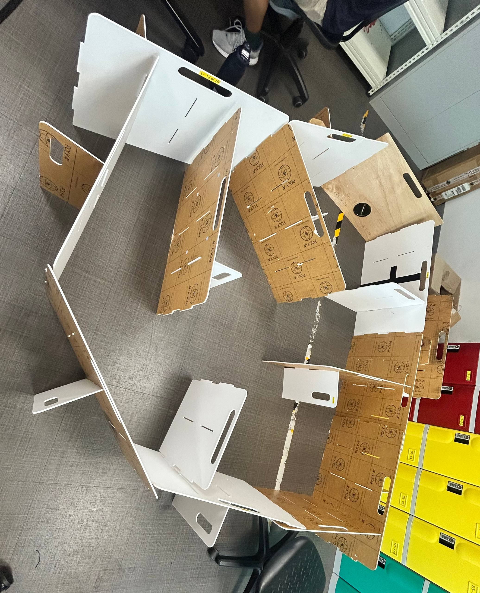
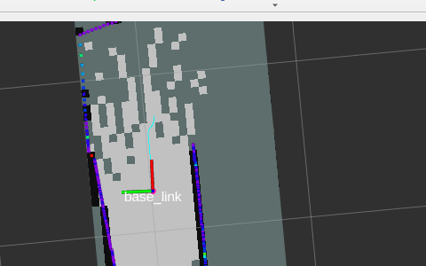
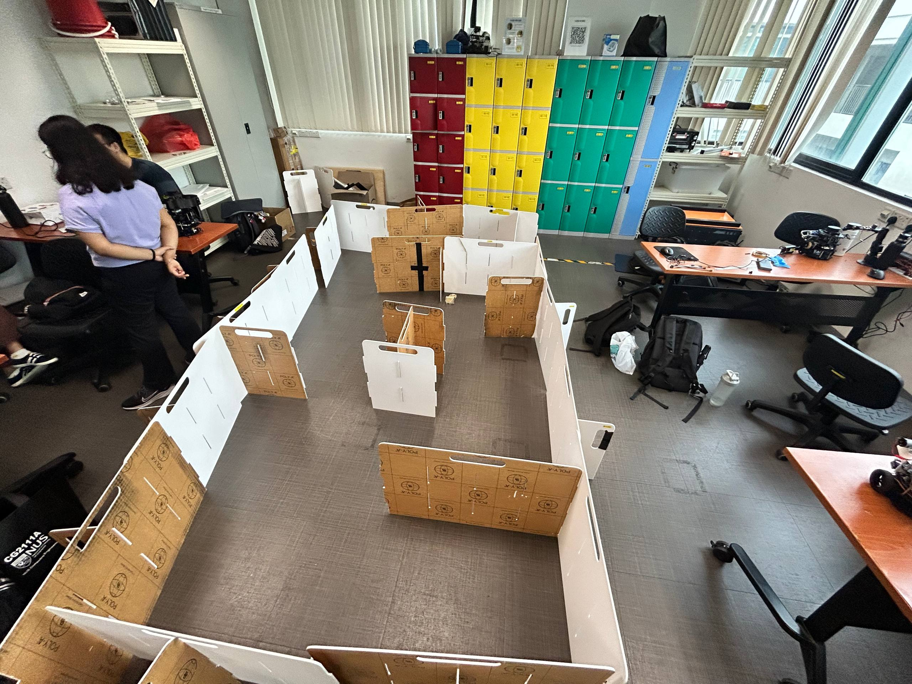
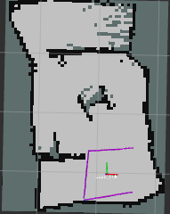

# 🔗 Navigation

- [Home](index.md)
- [Requirements Specification](requirements-specification.md)
- [Concept of Operations](con-ops.md)
- [High Level Design](high-level-design.md)
- [Software Subsystem: Navigation and FSM](subsystem-nav-fsm.md)
- [Software Subsystem: ArUco Marker Detection](subsystem-software-aruco.md)
- [Mechanical Subsystem](subsystem-mechanical.md)
- [Electrical Subsystem](subsystem-electrical.md)
- [Interface Control Document](interface-control-document.md)
- [Software and Firmware Development](software-firmware-development.md)
- [Testing Documentation](testing-documentation.md)
- [User Manual](user-manual.md)
- [Areas for Improvement](improvements.md)
- [Appendix](appendix.md)

---

# Testing Documentation

## Test Strategy

- Validate each subsystem independently.
- Validate launch interface compatibility.
- Validate the integrated mission stack.

## Subsystem Tests

### 1) Package + launch interface sanity

```bash
ros2 pkg list | grep auto_explore
ros2 launch auto_explore global_bringup.py --show-args
ros2 pkg executables auto_explore
```

Expected: package is discoverable, launch arguments are listed, and executables include mission and controller nodes.

### 2) Navigation infrastructure (SLAM/RViz)

```bash
ros2 launch auto_explore nav_bringup.py use_sim_time:=true enable_slam:=true enable_rviz:=false
```

Check:

```bash
ros2 topic list | grep -E '^/map$|^/map_metadata$'
```

Expected: `/map` is available and updating.

### 3) FSM only

```bash
ros2 launch auto_explore global_controller_bringup.py use_sim_time:=true \
	enable_fsm:=true enable_navigation:=false enable_markers:=false \
	enable_docking:=false enable_shooter:=false
```

Check:

```bash
ros2 topic echo /states
```

Expected: FSM publishes `EXPLORE` on startup.

### 4) Exploration controller only

```bash
ros2 launch auto_explore global_controller_bringup.py use_sim_time:=true \
	enable_fsm:=false enable_navigation:=true enable_markers:=false \
	enable_docking:=false enable_shooter:=false
```

Check:

```bash
ros2 topic hz /cmd_vel
ros2 topic echo /map_explored
```

Expected: `/cmd_vel` publishes while navigating; `/map_explored` eventually becomes true.

#### Navigation Testing Results (Physical Maze)

**Test Environment:** TurtleBot 3 Burger in physical maze  
**ROS 2 Distro:** Humble  
**Test Date Range:** 27/03 - 31/03/2026  

##### Session S1 (27/03, 3:32 PM) – SLAM Dependency Issues

| Metric | Result |
|--------|--------|
| Outcome | **Fail** |
| Run Time | 0 min 0 s |
| Mapped Area | 0% |
| Collisions | 0 / 0 |

**Configuration:**
- `lookahead_distance:` 0.24 m
- `speed:` 0.18 m/s
- `expansion_size:` 3
- `target_error:` 0.15 m
- `robot_r:` 0.2 m

**Observations:**
- SLAM Toolbox had QoS dependency issues; could run in Gazebo but not with robot bringup
- Bot did not move as no SLAM map was created

**Evidence:**
- 

**Changes for Next Session:**
- Updated SLAM configuration in `/opt/ros/humble/share/slam_toolbox/config/mapper_params_online_async.yaml`

---

##### Session S2 (27/03, 4:04 PM) – First Movement & Collision

| Metric | Result |
|--------|--------|
| Outcome | **Partial** |
| Run Time | 0 min 26 s |
| Mapped Area | ~5% |
| Collisions | 1 |

**Configuration:**
- `lookahead_distance:` 0.24 m
- `speed:` 0.18 m/s
- `expansion_size:` 3
- `target_error:` 0.15 m
- `robot_r:` 0.2 m
- Updated SLAM mapper parameters: `map_update_interval: 1.0`, `min_laser_range: 0.12`, `max_laser_range: 3.5`, `minimum_travel_distance: 0.2`

**Observations:**
- Bot collided with wall after first turn
- Map generated but SLAM latency caused delayed obstacle awareness
- Robot did not avoid walls/obstacles effectively

**Evidence:**
- 
- Video: [Collision Incident S2](../testing-media/videos/collision_s2.mp4)

**Changes for Next Session:**
- Reduce speed from 0.18 m/s to 0.09 m/s to counteract SLAM latency and enable smoother maneuvering

---

##### Session S3 (31/03, 3:27 PM) – Speed Reduction & Success

| Metric | Result |
|--------|--------|
| Outcome | **Success** ✓ |
| Run Time | 0 min 53 s |
| Mapped Area | 100% |
| Collisions | 0 / 0 |

**Configuration:**
- `lookahead_distance:` 0.24 m
- `speed:` 0.09 m/s *(reduced from 0.18)*
- `expansion_size:` 3
- `target_error:` 0.15 m
- `robot_r:` 0.2 m

**Procedure:**
- Max speed reduced from 0.18 m/s to 0.09 m/s to accommodate SLAM processing latency
- Robot allowed to explore maze autonomously without intervention

**Observations:**
- Robot successfully navigated entire maze without collision
- Reduced speed (0.09 m/s) provided sufficient time for SLAM to update map before path planning decisions
- Smooth exploration pattern with effective frontier detection
- No oscillation or navigation errors observed
- Complete map coverage achieved in under 1 minute
- Robot correctly transitioned to completion state upon 100% map coverage

**Evidence:**
- 
- Video: [Run Video S3](../testing-media/videos/exploration_run_s3.mp4)
- 

**Key Findings:**
- **Speed optimization is critical:** Reducing speed from 0.18 m/s to 0.09 m/s eliminated collisions
- **SLAM latency resolved:** Slower movement rate allowed map updates to propagate before path planning
- **Frontier algorithm effective:** Algorithm successfully identified and navigated to unexplored regions
- **Completion criteria met:** 100% map coverage achieved with zero collisions in 53 seconds

### 5) Marker detection only

```bash
ros2 launch auto_explore global_controller_bringup.py use_sim_time:=true \
	enable_fsm:=false enable_navigation:=false enable_markers:=true \
	enable_pose_publisher:=true enable_docking:=false enable_shooter:=false
```

Check:

```bash
ros2 topic echo /tf
ros2 topic echo /marker_detected
```

Expected: On topic `/tf` several different frame data would be visible, including Aruco Pose data with header frame 'camera_optical_frame' and child frame 'aruco_marker_*marker id*'. On marker detected you can expect boolean true on detection otherwise false. 

### 6) Docking controller only

```bash
ros2 launch auto_explore global_controller_bringup.py use_sim_time:=true \
	enable_fsm:=false enable_navigation:=false enable_markers:=false \
	enable_docking:=true enable_shooter:=false
```

Check:

```bash
ros2 topic info /cmd_vel_docking
ros2 topic info /dock_done
```

Expected: docking topics are present and node is alive.

### 7) Shooter controller only

Simulation-safe launch:

```bash
ros2 launch auto_explore global_controller_bringup.py use_sim_time:=true \
	enable_fsm:=false enable_navigation:=false enable_markers:=false \
	enable_docking:=false enable_shooter:=true shooter_enable_hardware:=false
```

Trigger shooter modes:

```bash
ros2 topic pub --once /shoot_type std_msgs/String "data: static"
ros2 topic pub --once /shoot_type std_msgs/String "data: dynamic"
```

Expected: shooter starts without GPIO access errors.

## Integration Tests

### Navigation + Mission Control

**Test Status:** In progress (pending S3 results)  

**Test Objective:** Verify frontier-based exploration integrates correctly with FSM state machine.

**Procedure:**
```bash
ros2 launch auto_explore global_controller_bringup.py use_sim_time:=false \
	enable_fsm:=true enable_navigation:=true enable_markers:=false \
	enable_docking:=false enable_shooter:=false
```

**Evidence Placeholder:**
- Video: [FSM State Transitions](../testing-media/videos/fsm_state_transitions_nav.mp4)
- 

### Marker Detection + Mission Control

- *To be tested in follow-up sessions*

### Full Bringup with Toggles Enabled

- *To be tested in follow-up sessions*

## End-to-End Mission Tests

### Full smoke test (simulation)

```bash
ros2 launch auto_explore global_bringup.py \
	use_sim_time:=true enable_slam:=true enable_rviz:=false \
	enable_fsm:=true enable_navigation:=true enable_markers:=true \
	enable_pose_publisher:=true enable_docking:=false enable_shooter:=false
```

Check:

```bash
ros2 topic list | grep -E '^/states$|^/aruco/debug$|^/cmd_vel$|^/map$|^/odom$'
```

Expected: critical topics are present and active.

### Full stack test (real robot)

Run robot bringup and launch integrated mission stack with real-time settings and hardware flags.

## Acceptance Criteria

- Required topics appear.
- Nodes launch without runtime exceptions.
- Mission states transition as expected.

## Navigation Subsystem Summary

**Subsystem Owner:** Navigation / Autonomous Exploration  
**Test Period:** 27/03/2026 – 31/03/2026  
**Physical Environment:** Maze with walls and tight passages  

### Test Results Summary

| Session | Date | Outcome | Key Issue | Speed | Mapped % | Collisions |
|---------|------|---------|-----------|-------|----------|------------|
| S1 | 27/03 | Fail | SLAM config error | 0.18 | 0% | 0 |
| S2 | 27/03 | Partial | Wall collision | 0.18 | 5% | 1 |
| S3 | 31/03 | **Success** | Speed optimization | 0.09 | **100%** | **0** |

### Key Learnings

1. **SLAM Latency:** Critical factor affecting real-time obstacle avoidance
2. **Speed Sensitivity:** Higher speeds (0.18 m/s) exceeded SLAM update rate; slower speeds (0.09 m/s) recommended
3. **Mapper Parameters:** Fine-tuning `map_update_interval`, `minimum_travel_distance`, and laser range bounds essential for responsiveness
4. **Frontier Algorithm:** Core algorithm functional; primary issue is external timing constraints rather than algorithmic failure

### Recommendations

- S3 parameters (speed: 0.09 m/s) are recommended for operational deployment
- Current configuration successfully meets acceptance criteria: 100% map coverage with 0 collisions
- Further optimization may focus on reducing exploration time without sacrificing safety
- Consider implementing dynamic speed scaling based on map confidence for future enhancements

## Known Test Gaps

- Long-duration exploration runs (>5 min) not yet validated
- Integration with full mission FSM (marker detection + docking) pending
- Hardware-specific validation remains dependent on available robot access

## Evidence and Results

- Suggested evidence artifacts:
	- topic snapshots (`ros2 topic list`, `ros2 topic hz`)
	- node lists (`ros2 node list`)
	- launch logs from `~/.ros/log/`
	- RViz screenshots or short run recordings
